<h1 align="center">
<picture>
<source media="(prefers-color-scheme: dark)" srcset="integration/custom_components/casa_mia/brand/dark_logo@2x.png">
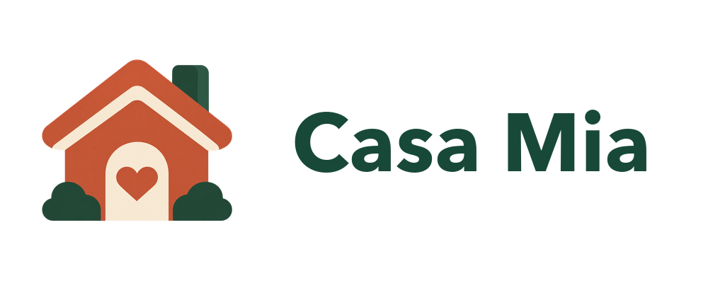
</picture>
</h1>

<p align="center"><strong><em>Make yourself at home, assistant!</em></strong></p>

<p align="center">
A Home Assistant app and integration that take your home from smart to spectacular.<br>
Dazzling home pages for every wall tablet. Guests signed in with a single scan.<br>
Every Kiosk Satellite managed from one place, and at your fingertips wherever you are.<br>
Interactions at jet-rapid speed. Camera dashboards MI5 would envy.<br>
Secure phone and SMS access to your home, even when the internet has left the building.<br>
And that's just the start.
</p>

<p align="center">

<a href="https://github.com/gazoodle/casa-mia/releases"></a>
<a href="https://github.com/gazoodle/casa-mia/releases/latest"></a>
<a href="https://github.com/gazoodle/casa-mia/actions/workflows/release.yml"></a>
<a href="#licence"></a>
</p>

<p align="center">
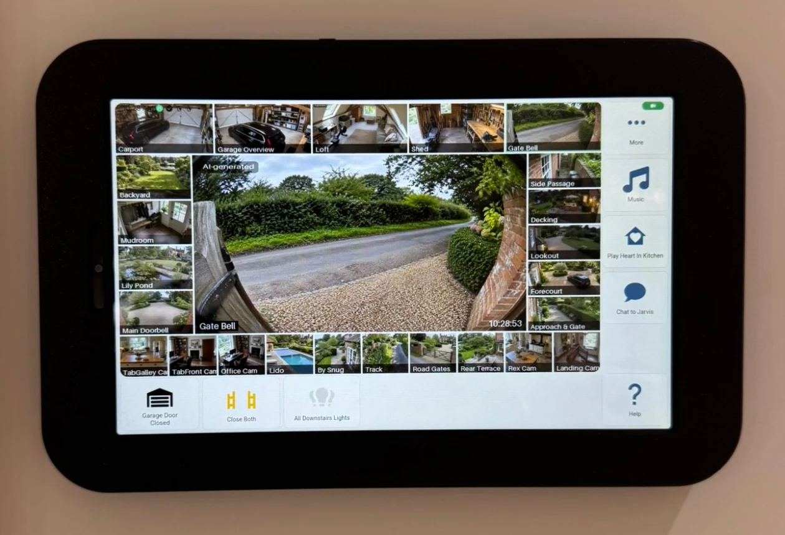<br>
<em>A wall tablet, live (in screenshot mode, so the camera pictures are AI-generated stand-ins)</em>
</p>

<p align="center"><strong>Free and open source, MIT licensed. Forever.</strong><br>
No premium tier, no subscription, no catch. <a href="#licence">Here's the promise.</a></p>

<p align="center"><a href="docs/README.md"><strong>📖 Documentation</strong></a> · <a href="docs/tablet-layout.md">Tablet Layout</a> · <a href="#working-together">Working together</a> · <a href="#installation">Installation</a></p>

## What is it?

* A home assistant layout view, based on Sections, but locked to the rendering screen size while still being responsive to content changes ([the Tablet Layout](docs/tablet-layout.md))
* A multi-camera layout and composition system to allow near realtime surveillance views without swamping network bandwidth or overwhelming low-power tablets
* A house guest login system that allows a QR scan to access a custom landing page
* A firmware server for the amazing [Kiosk Satellite](https://kiosksatellite.com) so they can stay on an IoT network, with no internet access, and not repeatedly keep downloading Candy Crush yet can still get updates from the GitHub releases.
* A (very) custom application to talk to my FONA GSM gateway (build notes to follow) that allows me to have secure phone and SMS access into my house.
* Tools to analyse performance hits so that the system remains responsive (avoids rolled eyes and sighs from family simply trying to get the radio to their favourite station)
* Some other very specialise stuff that I need in my house that I don't want to have to deploy separately, so it's in here too. Sorry, you don't have to turn it on.

## Your house, at a glance

<p align="center">
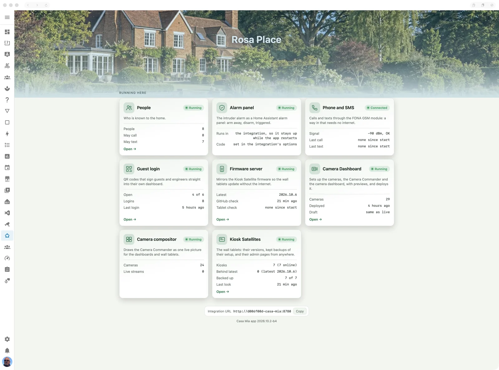
</p>

Everything lives in one panel in Home Assistant's sidebar: your own house across the top,
then a tile for every module with its vital signs, so one look tells you the whole place is
humming. It's served through ingress, so it's there wherever Home Assistant is: on the sofa,
at the office, or on a beach on the other side of the world. No ports to open, no extra
logins, no VPN.

## Tablet Layout

A wall tablet should show its dashboard the way a picture frame shows a picture: all of it,
edge to edge, nothing hanging off the bottom, and no scrolling. Ever. Home Assistant's views
are built for scrolling, so getting one to *just* fit a tablet meant an evening of CSS
tweaks ... and then a conditional card popped up, the page scrolled again, and the evening
started over. And don't even get me started on using stack cards in section views ...

The Tablet Layout is a new view type that ends all that. It *is* Home Assistant's own
Sections view, so every card, editor, visibility condition and badge works as it always has,
but its sections become panels round a main area, locked to the screen. A bigger screen, a
smaller screen, portrait, landscape: it fits. A card shows or hides: the panels make room,
or close up, by themselves.

<table>
<tr>
<td width="50%" valign="top">
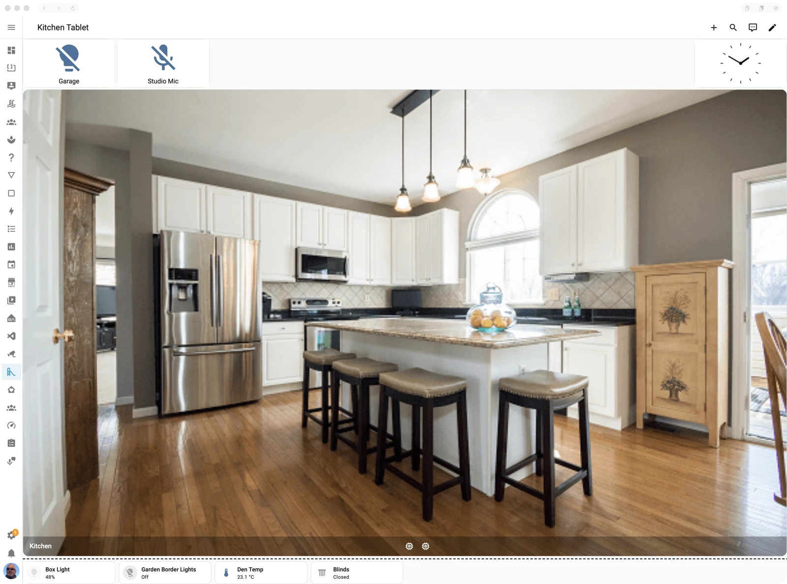
<h3>Fits the screen, exactly</h3>
Buttons across the top, the clock held to the right, a picture filling the middle, tiles along the bottom. Every pixel of the screen used, and not one more.
</td>
<td width="50%" valign="top">
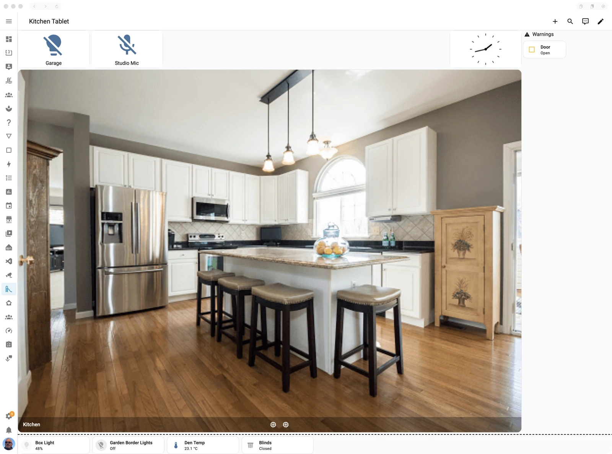
<h3>Panels that come and go</h3>
A door left open? A Warnings panel slides in at the side and everything else makes room. Close the door and it's gone, no gap left behind. Just Home Assistant's own visibility conditions, nothing new to learn.
</td>
</tr>
<tr>
<td width="50%" valign="top">
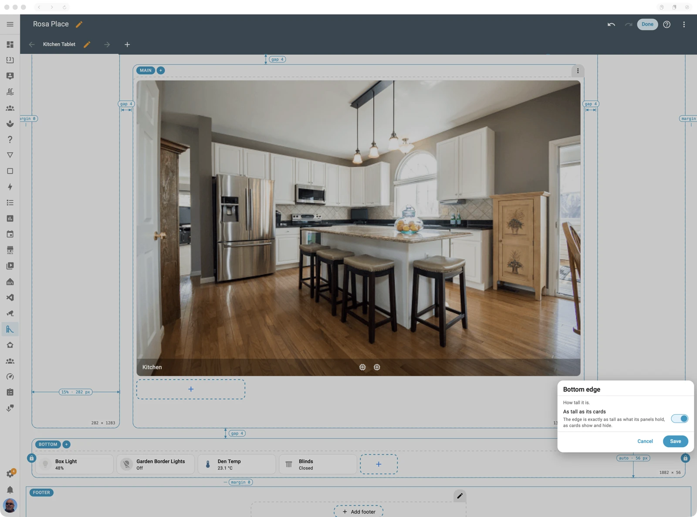
<h3>Edit it like a drawing</h3>
In edit mode the layout is a technical drawing: every panel, gap, margin and size, measured. Click any of them to change it, and watch the view change as you do.
</td>
<td width="50%" valign="top">
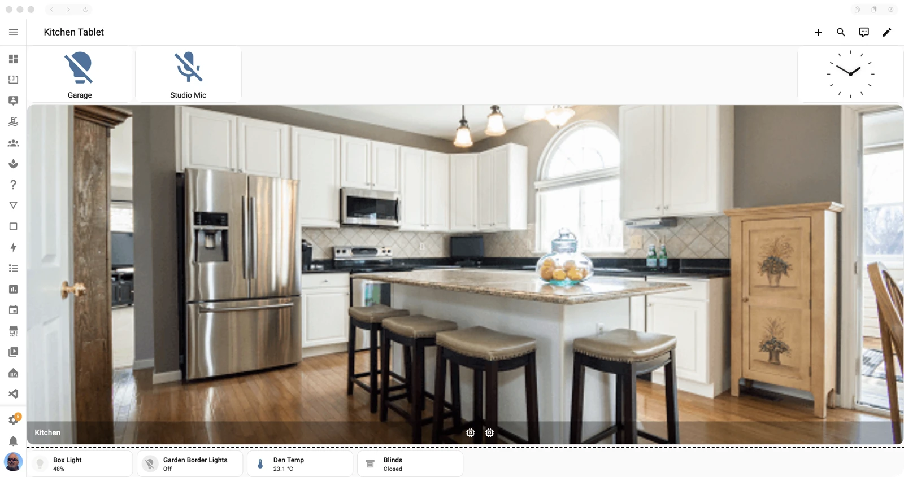
<h3>Any screen, no changes</h3>
The very same view in a wide desktop window, or on a tablet held upright. Nothing to set per screen: it simply fits.
</td>
</tr>
</table>

Panels in stacks, layers inside layers, gaps with lines in them, edges that hug their cards:
[the Tablet Layout guide](docs/tablet-layout.md) has the lot.

## Kiosk Satellite

<a href="https://kiosksatellite.com"></a>

[Kiosk Satellite](https://kiosksatellite.com) is [Xavier Larrea](https://github.com/jxlarrea)'s
wonderful app for putting Home Assistant on wall tablets ([source on GitHub](https://github.com/jxlarrea/kiosk-satellite)).
I've got a bunch of tablets around the house and it is, by far, the best way to run them.
Casa Mia looks after them for you. Kiosk Satellite and its logo are Xavier's (licensed
[CC BY-NC-ND 4.0](https://creativecommons.org/licenses/by-nc-nd/4.0/)); Casa Mia is a
separate project, not affiliated with it, and doesn't include any of it.

<br clear="left">

My tablets came with a bunch of nonsense pre-installed, so I deleted that, then had to put
them on a LAN with no internet access so they didn't download it all again ... but then they
couldn't update Kiosk Satellite. Xavier kindly added a custom update source, so Casa Mia
mirrors his releases and serves them to the tablets locally. Painless now.

Remembering to download each tablet's settings after I'd changed them was the one thing I
thought I could automate ... I was right. Casa Mia finds every tablet, keeps its settings
whenever they change, and Home Assistant's backups take them along. It also opens each
tablet's own control page through Home Assistant, so you can look after your wall tablets
when you're not at home. Nice!

<table>
<tr>
<td width="50%" valign="top">
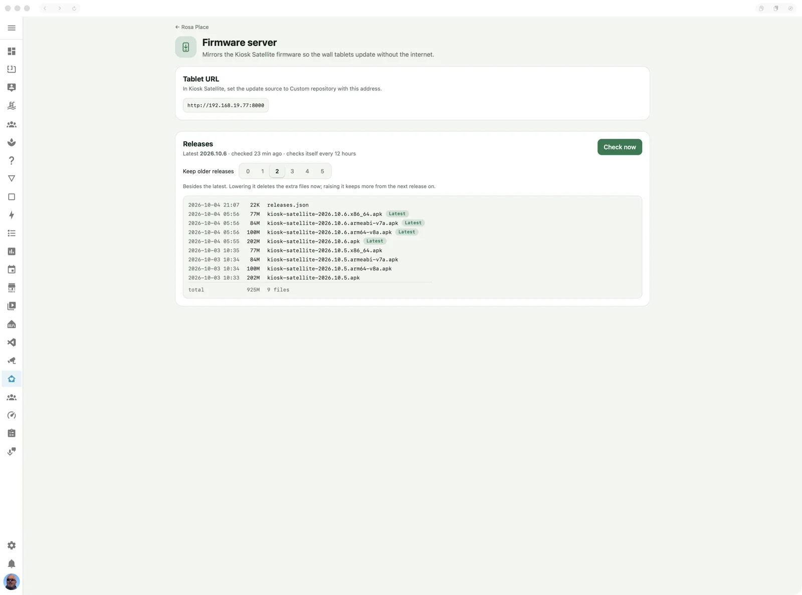
<h3>Firmware, on tap</h3>
Every Kiosk Satellite release, fetched and served to your tablets on your own network. They update themselves, and never need the internet.
</td>
<td width="50%" valign="top">
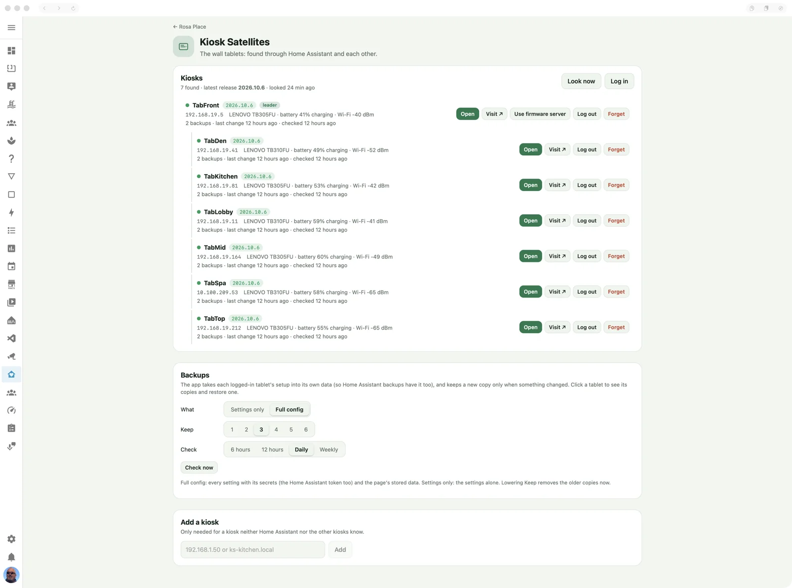
<h3>Every tablet, one page</h3>
Every Kiosk Satellite in the house, found by itself: its version, battery, Wi-Fi and last backup. Bring any of them up to date with a single press.
</td>
</tr>
<tr>
<td width="50%" valign="top">
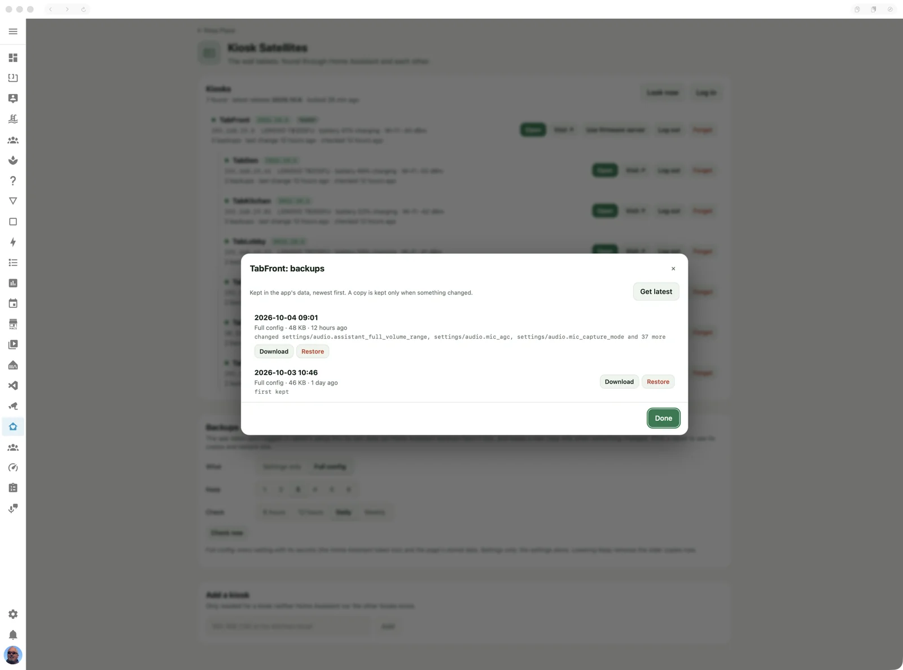
<h3>Backups that tell you what changed</h3>
Each tablet's settings are kept whenever they change, and every backup says exactly what changed. Fiddled with something and regretted it? Restore it in one click.
</td>
<td width="50%" valign="top">
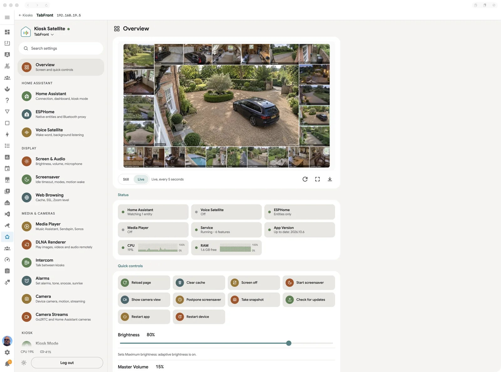
<h3>Your tablet, from anywhere</h3>
Any tablet's own Kiosk Satellite control page, straight through Home Assistant: its screen, its status, its quick controls and every setting. From your kitchen, or from another continent.
</td>
</tr>
</table>

## Camera commander

What I wanted was simple to say and surprisingly hard to get: a home page on the wall
tablets that looks great, shows the cameras I choose, laid out how I like, and responds the
moment you touch it. Not a grid of spinners, not a tablet that lags behind every tap, not
an afternoon of YAML every time a camera is added. Quick, good-looking, and configurable.

Every camera in the house in one live picture: a big main camera framed by all the others.
Tap a tile and it's on the big screen; tap the big screen and it plays live. You design it
in the Casa Mia panel, and Save puts it on every wall tablet at once. And this is only the
beginning: there's plenty more to come on this feature.

<table>
<tr>
<td width="50%" valign="top">
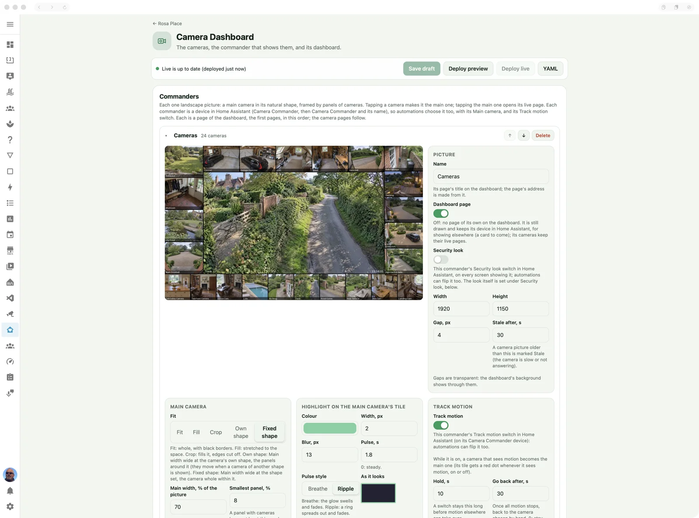
<h3>Design your control room</h3>
Lay out a commander in the Casa Mia panel: which cameras go where, how big the main one is, the highlight on its tile and the motion tracking. Its preview follows every change; Save puts it live.
</td>
<td width="50%" valign="top">
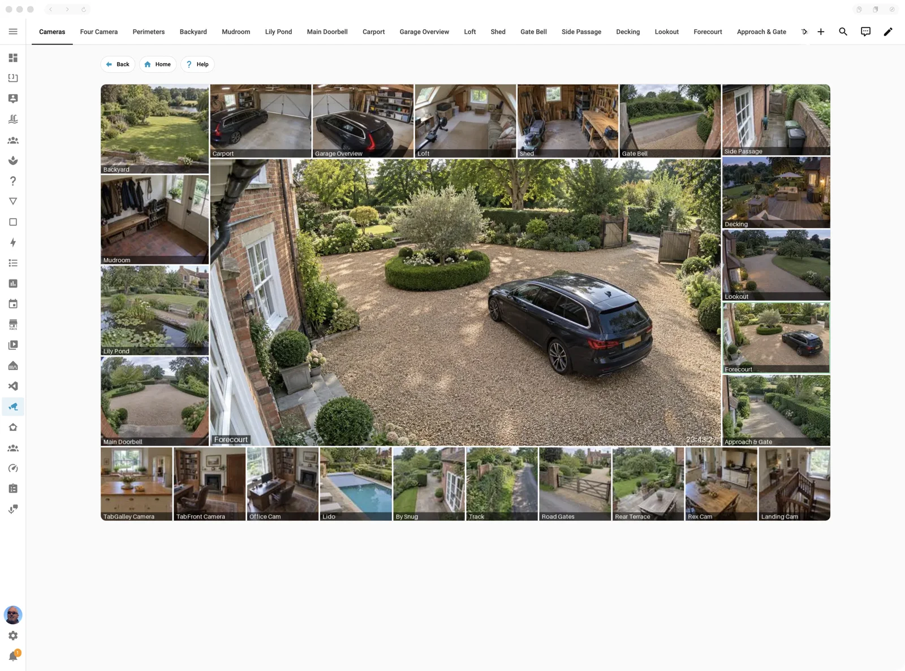
<h3>On your dashboard</h3>
The commander on a Home Assistant dashboard: every camera in one picture, and only one stream for the tablet to play, so even a modest wall tablet stays snappy.
</td>
</tr>
<tr>
<td width="50%" valign="top">
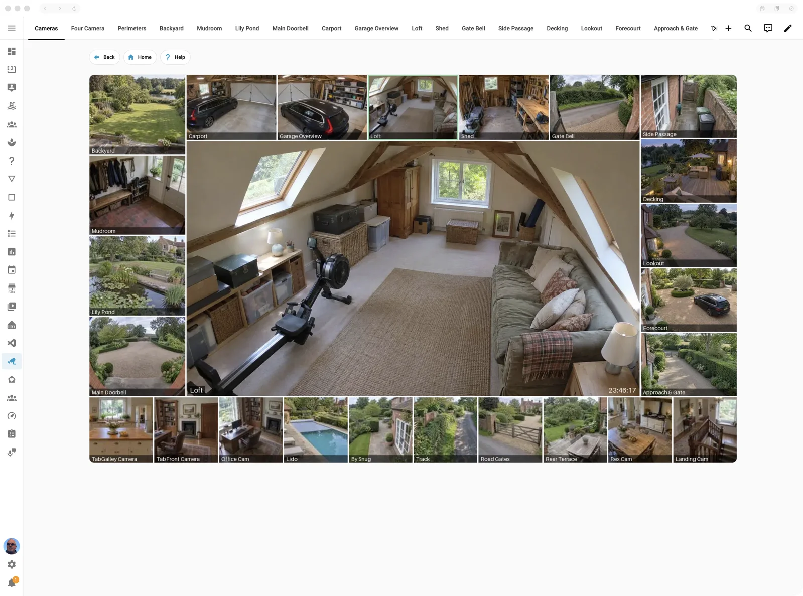
<h3>Tap, and it's on the big screen</h3>
Tap any tile and it becomes the main camera, in a moment. Switch on Track motion and the commander does it for you, following whatever moves around your home; a pulsing dot marks each camera seeing motion.
</td>
<td width="50%" valign="top">
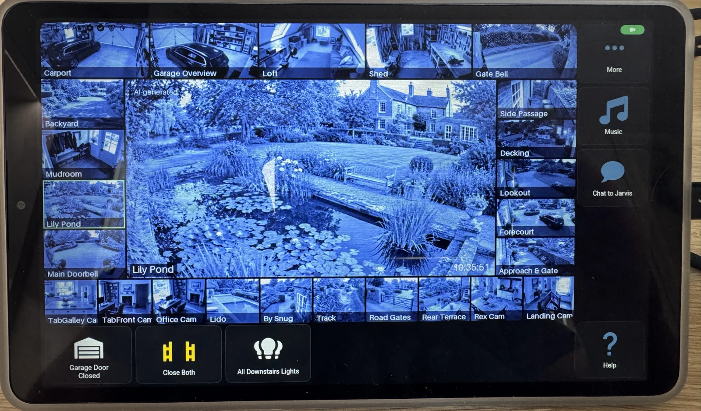
<h3>You want to feel like you work for MI5!</h3>
Switch on the Camera Commander card's Security look and every camera takes on the cool blue of a government control room, or any tint you choose. Here on a test tablet, in Home Assistant's dark theme. Coming next: switching it by a template, so it follows the night, the alarm, or just because.
</td>
</tr>
</table>

## Guest login

QR codes that sign a guest straight into their own dashboard, no password typing on a
stranger's phone. This started life as [ha-auto-guest-login](https://github.com/cnorick/ha-auto-guest-login)
by [Nathan Orick](https://github.com/cnorick), which I used for years (thank you!). Casa Mia's
version keeps the idea and adds:

- **A switch for every code.** Each QR code is an endpoint you can open and close from
  Home Assistant, so an automation can open it when guests arrive and close it when they
  leave.
- **Codes for everyone.** Family, friends, the engineer who needs the heating dashboard:
  each code chooses which login a visitor gets and which dashboard they land on.
- **A proper welcome.** While they're signed in, guests see your house and a welcome, not a
  login screen; preview it on a phone, a small phone or a tablet first.
- **A nicer front end**, all in the Casa Mia panel.
- **Your old cards still work.** If you've already printed QR cards for
  ha-auto-guest-login, tick **Legacy QR code** and they keep working.

<table>
<tr>
<td width="50%" valign="top">
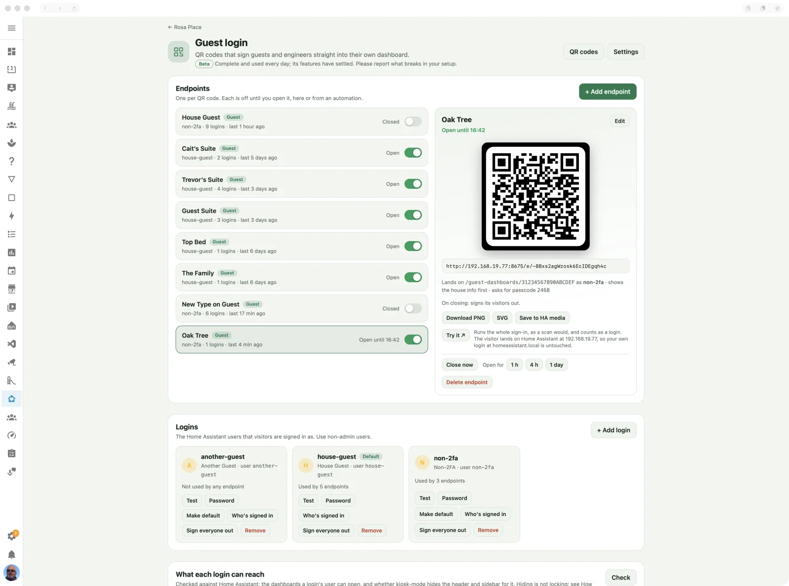
<h3>Guests, signed in with a scan</h3>
One QR code per kind of visitor, each with its switch. Guests scan it and land on their own dashboard: no app, no password, no fuss.
</td>
<td width="50%" valign="top">
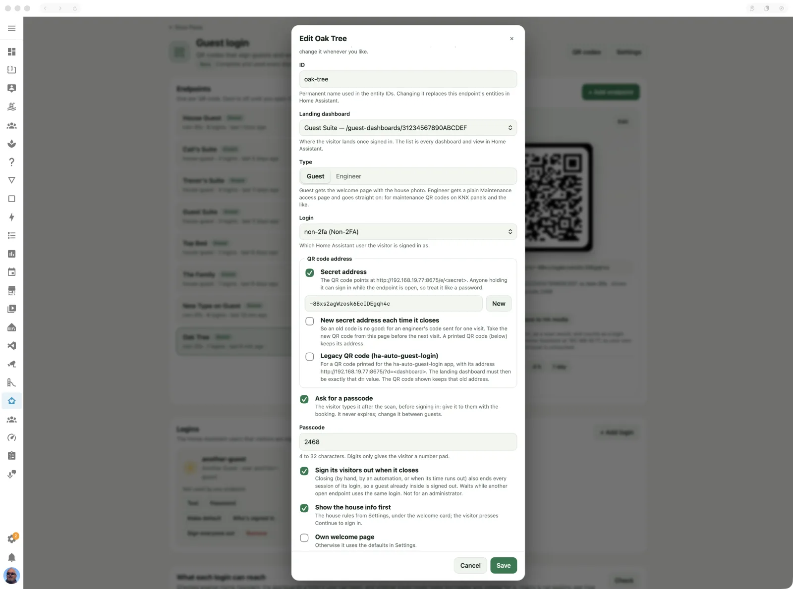
<h3>A code for every visitor</h3>
Each code's login, landing dashboard and secret address, set in one dialog.
</td>
</tr>
<tr>
<td width="50%" valign="top">
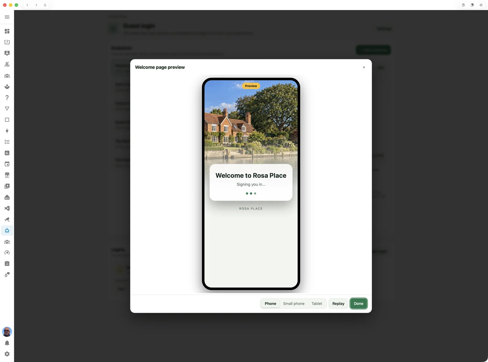
<h3>A proper welcome</h3>
Your house and a warm welcome while they're signed in, previewed here on a phone before anyone scans a thing.
</td>
<td width="50%" valign="top">
</td>
</tr>
</table>

## Camera compositor

The engine behind the camera commander. The [Advanced Camera Card](https://github.com/dermotduffy/advanced-camera-card)
is great, and it's still what plays a camera's own live page. But ask one of my poor
low-power wall tablets to play a dozen camera streams at once and it struggles; then the
streams struggle; then the tablet stops responding altogether. No one in the house likes
this.

So the compositor does the heavy lifting in the app instead. It gathers a picture from every
camera through Home Assistant, tiles them into one composite, and serves that as a single
stream: each commander is one stream for the tablet to play, however many cameras are in it.
The commander on the dashboard is just that picture with tap zones over it, and choosing the
main camera is a Home Assistant select, so a tap (or an automation) only asks the app to draw
the next picture differently. Nothing new has to start on the tablet, so the update is
quick, and those not-so-powerful tablets stay nice and snappy.

There's much more to come on this one.

## Phone and SMS (FONA)

This one's a bit esoteric. What happens when the internet goes down and you're on the wrong
side of the gate? An Arduino with an Adafruit FONA GSM board on the end of a USB cable,
that's what. Ring the house or text it, and if your number is on the list, Home Assistant
gets an "authorised" event and your automations do the rest (mine open the gates). Anyone
else is an intrusion, which you can also do something about. Text it PING and every layer
answers PONG, so you can tell exactly where things stopped working, and Home Assistant can
text back through it too. It has to be bulletproof, so it copes with the Arduino resetting,
the USB port moving and the line dropping, and it says so in the log when it does. Build
details (the Arduino sketch and how I built mine) are on their way into this repo, so you
can make your own.

<table>
<tr>
<td width="50%" valign="top">
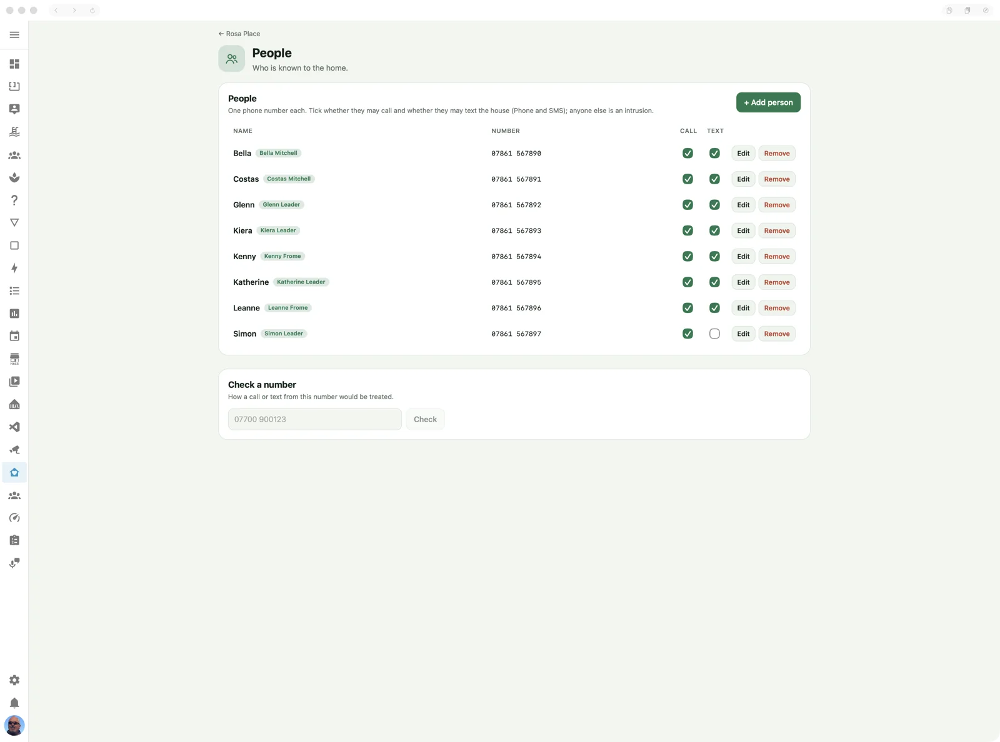
<h3>Who can call the house</h3>
The guest list for your home's own phone line: who may ring it and who may text it, one number each, linked to their Home Assistant person. Type a number the way you'd dial it; Casa Mia works out the rest, and there's a box to check what would happen before someone tries it for real.
</td>
<td width="50%" valign="top">
</td>
</tr>
</table>

## Alarm panel

I've got a KNX system with a couple of sensors and switches, but I wanted a nice alarm panel
with a code; you'd think that would be easy ... it's really not. My first go fell back to a
default code if you hadn't set one, silently ignored a wrong code, and (my favourite) arming
it while it was going off pressed the toggle, which disarmed it. This one refuses to do
anything until you've set a code, tells you when the code is wrong, and leaves a triggered
alarm well alone. It lives in the integration, so it keeps working while the app restarts.

## Dashboard helpers

A few small scripts Casa Mia can load into Home Assistant's frontend for you. Each one has
its own switch on the Casa Mia panel's Settings page (the cog by the house photo).

- **Back button (`#BACK`).** A dashboard button that navigates to `#BACK` goes back, like
  the browser's own Back. The camera dashboard's Back buttons use it.
- **Reload dashboards when they change.** A wall tablet shows a newly deployed dashboard
  without anyone touching it. It holds off while you're editing: some time ago, if you were
  editing in several places and something tweaked the dashboard elsewhere, the frontend
  reloaded and your edits were lost. Home Assistant may well have fixed that since, but this
  is careful either way.
- **Keep camera pictures live.** Stops the camera streams of pages that aren't on screen and
  restarts the ones that are, so a page you come back to has a live picture.

## Working together

Each module works on its own, but they all live in one app and one integration, so they
know about each other, and that shared knowledge lets the whole do things no single piece
could.

- **Pages that keep up with updates.** After an update, a page that was open all along is
  still running the old cards, so a new feature looks missing until someone thinks to
  refresh. The integration knows which cards it now serves, and every page checks after
  Home Assistant restarts: an out-of-date one offers a **Reload** in Home Assistant's own
  toast.
- **Wall tablets that reload themselves.** Nobody is there to press Reload on a wall
  tablet, so when Home Assistant starts serving new cards, the Kiosk Satellites module asks
  every tablet it looks after to reload.

Coming next:

- **The camera compositor knows its viewers:** its list of clients shows each wall tablet by
  name, not by IP address, with a link to its page.
- **Who's looking:** the integration knows each page's logged-in user, so the panels can say
  who and where.
- **Guests who say who they are:** an identify-yourself page with a PIN, so the house knows
  which guest is in.

## Installation

You need Home Assistant OS or a Supervised install (apps need the Supervisor), on a 64-bit
machine (aarch64 or amd64).

1. **Add the repository.** The quick way is this button, which opens your Home Assistant with
   the repository filled in:

   [](https://my.home-assistant.io/redirect/supervisor_add_addon_repository/?repository_url=https%3A%2F%2Fgithub.com%2Fgazoodle%2Fcasa-mia)

   Or do it by hand: go to **Settings → Apps → App store**, open the **⋮** menu at the top
   right, choose **Repositories**, and add:

   ```text
   https://github.com/gazoodle/casa-mia
   ```

2. **Install the app.** Close the dialog, find **Casa Mia** in the store (refresh the page if
   it isn't there yet), open it and press **Install**. It downloads the ready-built app from
   the GitHub Container Registry, so there's nothing to compile.

3. **Choose your modules.** On the app's **Configuration** tab, give your house its name and
   switch on the modules you want (they all start off): the firmware server, Kiosk
   Satellites, guest login, Camera Commander and Auto Dashboards, phone and SMS (FONA),
   the alarm panel. Press **Save**. You can come back and change these at any time.

4. **Start it.** On the **Info** tab, switch on **Show in sidebar** and press **Start**.
   **Casa Mia** appears in the sidebar.

5. **Restart Home Assistant.** On its first start the app installs its integration into your
   `custom_components` folder, and Home Assistant only loads it after a restart: **Settings →
   System → ⋮ → Restart Home Assistant**. A Repair tells you whenever an update needs another.

6. **Add the integration.** Go to **Settings → Devices & services → Add integration**, search
   for **Casa Mia**, and press **Submit**: it finds the app by itself. (If it doesn't, copy the
   **Integration URL** from the foot of the Casa Mia panel's home page and paste it in.)

7. **Make yourself at home.** Open **Casa Mia** from the sidebar and visit each module's page
   to set it up. Its devices and entities appear in Home Assistant as you go.

Updates arrive like any other app's: Home Assistant offers them under **Settings → Updates**,
and the integration is updated along with the app.

## Documentation

The [documentation](docs/README.md) has a page for each part of the Casa Mia panel, the full
Tablet Layout reference, and, [behind the scenes](docs/architecture.md), how it's all built.

## Thanks

- [Xavier Larrea (jxlarrea)](https://github.com/jxlarrea), for [Kiosk Satellite](https://kiosksatellite.com),
  and for adding the custom update source that made the firmware server possible.
- [Nathan Orick (cnorick)](https://github.com/cnorick), for [ha-auto-guest-login](https://github.com/cnorick/ha-auto-guest-login),
  which guest login grew out of.
- [Dermot Duffy (dermotduffy)](https://github.com/dermotduffy), for the [Advanced Camera Card](https://github.com/dermotduffy/advanced-camera-card),
  which the camera dashboards are built on.
- [Adafruit](https://www.adafruit.com), for the FONA GSM board and its Arduino library, the
  heart of the phone and SMS line.
- The [Home Assistant](https://www.home-assistant.io) project and its community, for the
  platform all of this plugs into.

## Licence

**Casa Mia is free, open source, and MIT licensed. Forever.**

No "community edition". No premium tier waiting in the wings. No gathering users now and
slapping a licence fee on it later, like so much else on the internet. There's nothing to
buy, nothing to subscribe to, and no account to sign up for; every line of it is right here.

Use it, change it, share it, fork it, build on it; just keep the [MIT](LICENSE) notice.
© 2026 Gazoodle.

## Footnote

🦶 🎵
