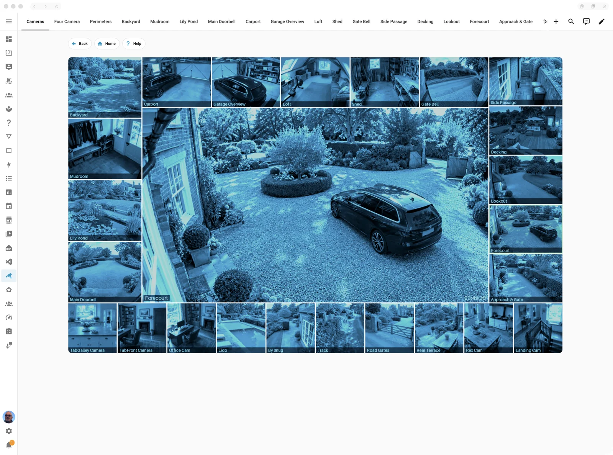

<h1 align="center">
<picture>
<source media="(prefers-color-scheme: dark)" srcset="integration/custom_components/casa_mia/brand/dark_logo@2x.png">

</picture>
</h1>

<p align="center"><strong><em>Make yourself at home, assistant!</em></strong></p>

<p align="center">
A Home Assistant app and integration that take your home from smart to spectacular.<br>
Dazzling home pages for every wall tablet. Guests signed in with a single scan.<br>
Every Kiosk Satellite managed from one place, and at your fingertips wherever you are.<br>
Interactions at jet-rapid speed. Camera dashboards MI5 would envy.<br>
Secure phone and SMS access to your home, even when the internet has left the building.<br>
And that's just the start.
</p>

<p align="center">

<a href="https://github.com/gazoodle/casa-mia/releases"></a>
<a href="https://github.com/gazoodle/casa-mia/releases/latest"></a>
<a href="https://github.com/gazoodle/casa-mia/actions/workflows/release.yml"></a>
<a href="#licence"></a>
</p>

<p align="center"><strong>Free and open source, MIT licensed. Forever.</strong><br>
No premium tier, no subscription, no catch. <a href="#licence">Here's the promise.</a></p>

## What is it?

It's a collection of useful functionality that I've gathered and written over years of being
an HA enthusiast. It was getting to the point where it was unmanageable as there were so many
little pieces, some in source control, others tucked into community notes, some deployed from
stale repos; so I thought Claude, Codex and I could pull them together and clean them up, and
in the process have a truckload of fun building stuff that I normally can't be bothered to do.

During that process I realised that there was quite a bit of stuff that other people might
find useful too, so ... this project got created. Between us we've now built an entire
Home Assistant app to host parts of it, an integration to expose parts of it for automation,
and even an entire release system so I don't forget any of the steps. I've got a heap of
neat ideas to keep going with, so if you're interested, come along for the ride, give me
feedback, and ask for features.

I've been writing software for decades, actually nearly half a century [yikes], so I spend
quite a bit of my time shouting at AI dev tools because they keep making the same idiotic
mistakes, but my-oh-my when they are marshalled in the correct direction, they build some
lovely software. I do curate everything they do, and I often berate them about DRY, YAGNI
and optimisation, so it's not totally AI slop ... well, there might be a smidgen of it :-)

Anyway, moving on. Every time I go looking for useful stuff and inspiration, I'm interested
in what it looks like and what I can create with it, so here are some screenshots of what you
get and what you can achieve. Click any of them to see it full size.

## Your house, at a glance

<p align="center">

</p>

Everything lives in one panel in Home Assistant's sidebar: your own house across the top,
then a tile for every module with its vital signs, so one look tells you the whole place is
humming. It's served through ingress, so it's there wherever Home Assistant is: on the sofa,
at the office, or on a beach on the other side of the world. No ports to open, no extra
logins, no VPN.

## Kiosk Satellite

<a href="https://kiosksatellite.com"></a>

[Kiosk Satellite](https://kiosksatellite.com) is [Xavier Larrea](https://github.com/jxlarrea)'s
wonderful app for putting Home Assistant on wall tablets ([source on GitHub](https://github.com/jxlarrea/kiosk-satellite)).
I've got a bunch of tablets around the house and it is, by far, the best way to run them.
Casa Mia looks after them for you. Kiosk Satellite and its logo are Xavier's (licensed
[CC BY-NC-ND 4.0](https://creativecommons.org/licenses/by-nc-nd/4.0/)); Casa Mia is a
separate project, not affiliated with it, and doesn't include any of it.

<br clear="left">

My tablets came with a bunch of nonsense pre-installed, so I deleted that, then had to put
them on a LAN with no internet access so they didn't download it all again ... but then they
couldn't update Kiosk Satellite. Xavier kindly added a custom update source, so Casa Mia
mirrors his releases and serves them to the tablets locally. Painless now.

Remembering to download each tablet's settings after I'd changed them was the one thing I
thought I could automate ... I was right. Casa Mia finds every tablet, keeps its settings
whenever they change, and Home Assistant's backups take them along. It also opens each
tablet's own control page through Home Assistant, so you can look after your wall tablets
when you're not at home. Nice!

<table>
<tr>
<td width="50%" valign="top">

<h3>Firmware, on tap</h3>
Every Kiosk Satellite release, fetched and served to your tablets on your own network. They update themselves, and never need the internet.
</td>
<td width="50%" valign="top">

<h3>Every tablet, one page</h3>
Every Kiosk Satellite in the house, found by itself: its version, battery, Wi-Fi and last backup. Bring any of them up to date with a single press.
</td>
</tr>
<tr>
<td width="50%" valign="top">

<h3>Backups that tell you what changed</h3>
Each tablet's settings are kept whenever they change, and every backup says exactly what changed. Fiddled with something and regretted it? Restore it in one click.
</td>
<td width="50%" valign="top">

<h3>Your tablet, from anywhere</h3>
Any tablet's own Kiosk Satellite control page, straight through Home Assistant: its screen, its status, its quick controls and every setting. From your kitchen, or from another continent.
</td>
</tr>
</table>

## Camera commander

What I wanted was simple to say and surprisingly hard to get: a home page on the wall
tablets that looks great, shows the cameras I choose, laid out how I like, and responds the
moment you touch it. Not a grid of spinners, not a tablet that lags behind every tap, not
an afternoon of YAML every time a camera is added. Quick, good-looking, and configurable.

Every camera in the house in one live picture: a big main camera framed by all the others.
Tap a tile and it's on the big screen; tap the big screen and you're on that camera's own
live page. You design it in the Casa Mia panel, try it out on a preview dashboard, and
deploy it to your real one when it's right. And this is only the beginning: there's plenty
more to come on this feature.

<table>
<tr>
<td width="50%" valign="top">

<h3>Design your control room</h3>
Lay out a commander in the Casa Mia panel: which cameras go where, how big the main one is, the highlight on its tile and the motion tracking. Preview it, then deploy it live.
</td>
<td width="50%" valign="top">

<h3>On your dashboard</h3>
The commander on a Home Assistant dashboard: every camera in one picture, and only one stream for the tablet to play, so even a modest wall tablet stays snappy.
</td>
</tr>
<tr>
<td width="50%" valign="top">

<h3>Tap, and it's on the big screen</h3>
Tap any tile and it becomes the main camera, in a moment. Switch on Track motion and the commander does it for you, following whatever moves around your home.
</td>
<td width="50%" valign="top">

<h3>You want to feel like you work for MI5!</h3>
Flip the Security look switch and every camera takes on the cool blue of a government control room. Automations can flip it too: at night, when the alarm is set, or just because.
</td>
</tr>
</table>

## Guest login

QR codes that sign a guest straight into their own dashboard, no password typing on a
stranger's phone. This started life as [ha-auto-guest-login](https://github.com/cnorick/ha-auto-guest-login)
by [Nathan Orick](https://github.com/cnorick), which I used for years (thank you!). Casa Mia's
version keeps the idea and adds:

- **A switch for every code.** Each QR code is an endpoint you can open and close from
  Home Assistant, so an automation can open it when guests arrive and close it when they
  leave.
- **Codes for everyone.** Family, friends, the engineer who needs the heating dashboard:
  each code chooses which login a visitor gets and which dashboard they land on.
- **A proper welcome.** While they're signed in, guests see your house and a welcome, not a
  login screen; preview it on a phone, a small phone or a tablet first.
- **A nicer front end**, all in the Casa Mia panel.
- **Your old cards still work.** If you've already printed QR cards for
  ha-auto-guest-login, tick **Legacy QR code** and they keep working.

<table>
<tr>
<td width="50%" valign="top">

<h3>Guests, signed in with a scan</h3>
One QR code per kind of visitor, each with its switch. Guests scan it and land on their own dashboard: no app, no password, no fuss.
</td>
<td width="50%" valign="top">

<h3>A code for every visitor</h3>
Each code's login, landing dashboard and secret address, set in one dialog.
</td>
</tr>
<tr>
<td width="50%" valign="top">

<h3>A proper welcome</h3>
Your house and a warm welcome while they're signed in, previewed here on a phone before anyone scans a thing.
</td>
<td width="50%" valign="top">
</td>
</tr>
</table>

## Camera compositor

The engine behind the camera commander. The [Advanced Camera Card](https://github.com/dermotduffy/advanced-camera-card)
is great, and it's still what plays a camera's own live page. But ask one of my poor
low-power wall tablets to play a dozen camera streams at once and it struggles; then the
streams struggle; then the tablet stops responding altogether. No one in the house likes
this.

So the compositor does the heavy lifting in the app instead. It gathers a picture from every
camera through Home Assistant, tiles them into one composite, and serves that as a single
stream: each commander is one stream for the tablet to play, however many cameras are in it.
The commander on the dashboard is just that picture with tap zones over it, and choosing the
main camera is a Home Assistant select, so a tap (or an automation) only asks the app to draw
the next picture differently. Nothing new has to start on the tablet, so the update is
quick, and those not-so-powerful tablets stay nice and snappy.

There's much more to come on this one.

## Phone and SMS (FONA)

This one's a bit esoteric. What happens when the internet goes down and you're on the wrong
side of the gate? An Arduino with an Adafruit FONA GSM board on the end of a USB cable,
that's what. Ring the house or text it, and if your number is on the list, Home Assistant
gets an "authorised" event and your automations do the rest (mine open the gates). Anyone
else is an intrusion, which you can also do something about. Text it PING and every layer
answers PONG, so you can tell exactly where things stopped working, and Home Assistant can
text back through it too. It has to be bulletproof, so it copes with the Arduino resetting,
the USB port moving and the line dropping, and it says so in the log when it does. Build
details (the Arduino sketch and how I built mine) are on their way into this repo, so you
can make your own.

<table>
<tr>
<td width="50%" valign="top">

<h3>Who can call the house</h3>
The guest list for your home's own phone line: who may ring it and who may text it, one number each, linked to their Home Assistant person. Type a number the way you'd dial it; Casa Mia works out the rest, and there's a box to check what would happen before someone tries it for real.
</td>
<td width="50%" valign="top">
</td>
</tr>
</table>

## Alarm panel

I've got a KNX system with a couple of sensors and switches, but I wanted a nice alarm panel
with a code; you'd think that would be easy ... it's really not. My first go fell back to a
default code if you hadn't set one, silently ignored a wrong code, and (my favourite) arming
it while it was going off pressed the toggle, which disarmed it. This one refuses to do
anything until you've set a code, tells you when the code is wrong, and leaves a triggered
alarm well alone. It lives in the integration, so it keeps working while the app restarts.

## Dashboard helpers

A few small scripts Casa Mia can load into Home Assistant's frontend for you. Each one has
its own switch on the Casa Mia panel's Settings page (the cog by the house photo).

- **Back button (`#BACK`).** A dashboard button that navigates to `#BACK` goes back, like
  the browser's own Back. The camera dashboard's Back buttons use it.
- **Reload dashboards when they change.** A wall tablet shows a newly deployed dashboard
  without anyone touching it. It holds off while you're editing: some time ago, if you were
  editing in several places and something tweaked the dashboard elsewhere, the frontend
  reloaded and your edits were lost. Home Assistant may well have fixed that since, but this
  is careful either way.
- **Keep camera pictures live.** Stops the camera streams of pages that aren't on screen and
  restarts the ones that are, so a page you come back to has a live picture. It also gives
  the cameras the Security look.

## Installation

You need Home Assistant OS or a Supervised install (apps need the Supervisor), on a 64-bit
machine (aarch64 or amd64).

1. **Add the repository.** The quick way is this button, which opens your Home Assistant with
   the repository filled in:

   [](https://my.home-assistant.io/redirect/supervisor_add_addon_repository/?repository_url=https%3A%2F%2Fgithub.com%2Fgazoodle%2Fcasa-mia)

   Or do it by hand: go to **Settings → Apps → App store**, open the **⋮** menu at the top
   right, choose **Repositories**, and add:

   ```text
   https://github.com/gazoodle/casa-mia
   ```

2. **Install the app.** Close the dialog, find **Casa Mia** in the store (refresh the page if
   it isn't there yet), open it and press **Install**. It downloads the ready-built app from
   the GitHub Container Registry, so there's nothing to compile.

3. **Choose your modules.** On the app's **Configuration** tab, give your house its name and
   switch on the modules you want (they all start off): the firmware server, Kiosk
   Satellites, guest login, the camera compositor and Camera Dashboard, phone and SMS (FONA),
   the alarm panel. Press **Save**. You can come back and change these at any time.

4. **Start it.** On the **Info** tab, switch on **Show in sidebar** and press **Start**.
   **Casa Mia** appears in the sidebar.

5. **Restart Home Assistant.** On its first start the app installs its integration into your
   `custom_components` folder, and Home Assistant only loads it after a restart: **Settings →
   System → ⋮ → Restart Home Assistant**. A Repair tells you whenever an update needs another.

6. **Add the integration.** Go to **Settings → Devices & services → Add integration**, search
   for **Casa Mia**, and press **Submit**: it finds the app by itself. (If it doesn't, copy the
   **Integration URL** from the foot of the Casa Mia panel's home page and paste it in.)

7. **Make yourself at home.** Open **Casa Mia** from the sidebar and visit each module's page
   to set it up. Its devices and entities appear in Home Assistant as you go.

Updates arrive like any other app's: Home Assistant offers them under **Settings → Updates**,
and the integration is updated along with the app.

## Thanks

- [Xavier Larrea (jxlarrea)](https://github.com/jxlarrea), for [Kiosk Satellite](https://kiosksatellite.com),
  and for adding the custom update source that made the firmware server possible.
- [Nathan Orick (cnorick)](https://github.com/cnorick), for [ha-auto-guest-login](https://github.com/cnorick/ha-auto-guest-login),
  which guest login grew out of.
- [Dermot Duffy (dermotduffy)](https://github.com/dermotduffy), for the [Advanced Camera Card](https://github.com/dermotduffy/advanced-camera-card),
  which the camera dashboards are built on.
- [Adafruit](https://www.adafruit.com), for the FONA GSM board and its Arduino library, the
  heart of the phone and SMS line.
- The [Home Assistant](https://www.home-assistant.io) project and its community, for the
  platform all of this plugs into.

## Licence

**Casa Mia is free, open source, and MIT licensed. Forever.**

No "community edition". No premium tier waiting in the wings. No gathering users now and
slapping a licence fee on it later, like so much else on the internet. There's nothing to
buy, nothing to subscribe to, and no account to sign up for; every line of it is right here.

Use it, change it, share it, fork it, build on it; just keep the [MIT](LICENSE) notice.
© 2026 Gazoodle.

## Under the hood

Everything custom one home needs from Home Assistant, in one repo: an HA **app**, an
**integration**, device firmware, generators and provisioning tools. It is the embryonic form
of a **deterministically built HA config**: the box's behaviour is derived from this repo, not
accreted by clicking in the UI.

It is built for one real house and offered as-is to anyone who wants the same: every module is
switched off until you enable it, so take the parts you need. Your house's name is an app
option (`house_name`), shown wherever the UI names the house.

**Status:** the app, the integration, the delivery loop (commit, App store refresh, app update, integration
pushed into `/config/custom_components`, "restart required" Repair) and the modules marked ✅
below run on a live box. This file is the charter; unscheduled work is in
[BACKLOG.md](BACKLOG.md), and the open questions at the bottom are turned into decisions as we go.

## Why

Custom pieces built one at a time each re-solve the same things:

- A GSM board that is the way in when the internet is down (FONA).
- A camera compositor and its adaptive dashboard.
- An alarm panel, a firmware mirror for the wall tablets, and other ideas.
- Arduino firmware for FONA, an ESPHome generator, a tablet provisioner, a KNX project.
- Third-party apps that may no longer be maintained: `ha-auto-guest-login`
  (MIT, last update 2025) is taken over and rewritten as a module.

**Out of scope by design:** other projects (public, shared or someone else's, such as
`advanced-camera-card`) do not live here. Nothing in this repo may be a dependency of them;
this repo may consume their published releases.

Everything in the house is one system built from one master project: ESPHome devices, KNX,
FONA, tablets, cameras and the HA config are all generated or deployed from the same sources.

Each one re-solves deployment, auth, health reporting and config. This project solves
those once, and each piece becomes a **module** that plugs in.

## Goals

1. **Mission-critical things stay up.** FONA (home access with the internet down) is the
   first citizen: reconnects by itself, reports when it goes quiet, never depends on a
   fragile device path.
2. **Edit on the local dev system, live in under a minute.** No GitHub credentials on the HA box.
3. **Add a module cheaply.** A new capability is a folder, not a new project.
4. **Small backups.** No caches or downloaded models inside the app's backed-up data.
5. **Observable.** Every module reports health as entities and as HA Repairs.

## Non-goals (for now)

- Publishing to HACS or the official app store.
- Replacing Music Assistant, UniFi Protect or other maintained integrations. KNX the same:
  we generate and consume the KNX project and control it through HA, not replace the stack.
- Supporting installs other than HA OS on one primary box.

## Modules (initial scope)

Details of each are to be taken from the existing code, not rewritten from memory. Every
module is a candidate for the public release (the Public column); each is off until enabled.

| Module | What it does | Mission-critical | Source to learn from | Public | Completed? |
|---|---|---|---|---|---|
| `fona` | Phone and SMS: calls and texts over the Arduino/GSM board, checked against `people` in the app, then one HA event each (authorised or intrusion); HA automations decide what happens and reply. PING answered by every layer. Built in app 0.1.31 / integration 0.5.0, awaiting cut-over. The Arduino sketch and build plan are to be published with it | **Yes** | The earlier `fona_sms` custom component, the `FonaForHA` Arduino sketch | Candidate | ⬜ |
| `people` | Everyone known to the home. Today one phone number each with Call and Text ticks, optionally linked to an HA person. Always on; People page in the panel. Built in app 0.1.31 | No | An earlier allowlist (a to-do list plus a pyscript, replaced) | Candidate | ⬜ |
| `alarm` | Intruder alarm panel (arm away, disarm, triggered) in the integration only, driven by the panel's ESPHome sensors and toggle button; code in the integration's options; `alarm_enabled` app option (default off) switches it on. **Complete (integration 0.4.0, app 0.1.27).** The sensor and switch entity ids are fixed in `alarm.py` today; they must become options before release | Likely | An earlier alarm-panel custom component | Candidate | ✅ |
| Firmware Server (`gitproxy`) | Mirrors the Kiosk Satellite firmware and serves it to the tablets on port 8000 (`gitproxy_enabled` app option, default off); the integration shows its state and latest version. **Built (app 0.1.10).** Includes a Force check button and download progress, on its own "Firmware server" device. | Yes (deployment path) | `tablet-provision/fake_git_host.py` | Candidate | ✅ |
| `compositor` | Camera compositing and the adaptive dashboard. App module built (app 0.1.11): serves each Camera Commander's picture on port 8099 from the Camera Dashboard's live config, `compositor_enabled` option (default off) | No | composite-test server | Candidate | ✅ |
| `camera_dashboard` | Camera Dashboard: one source (`camera-dashboard.json`, the draft, and `camera-dashboard-live.json`, what was deployed) for the cameras, the Camera Commanders (one or more, each a page), and the camera dashboard. Admin page with previews (a second compositor on 8098 draws the draft), deploys the dashboard into HA over the websocket (storage mode: preview to `<dashboard>-preview`, live to the dashboard, keeping what it replaces), `camera_dashboard_enabled` option (default off). Was `dashboard-gen` | No | `tablet-provision/composite-test/gen_dashboard.py`, `discover_entities.py` | Candidate | ✅ |
| `knx` | KNX project (ETS export) consumed to generate HA entities/config and drive control | Likely | KNX project (TBD) | Candidate | ⬜ |
| `knx-bms` | A Raspberry Pi KNX machine: BMS programming control over the KNX bus, like logic modules but with better programming. First job: bring the Hue lights into the BMS, out of HA (backlog) | TBD | The Pi's existing code (to be located) | Candidate | ⬜ |
| `esphome-gen` | Python generator that deterministically builds the ESPHome YAML for every Shelly and other ESP device in the automation system | No (devices it configures may be) | The current ESPHome generator script | Candidate | ⬜ |
| `radio` | Local radio station (Docker stack, on a NAS today); may move onto HA | No | Docker compose/config on the NAS (TBD) | Candidate | ⬜ |
| `tablet-provision` | Provisions wall tablets | No | `tablet-provision` repo | Candidate | ⬜ |
| `guest-login` | Guests and engineers scan a QR code, are signed into HA and land on their own dashboard; replaces `cnorick/ha-auto-guest-login`. Endpoints (one per QR code, printed `?d=` codes kept working) are off until opened, by switch, timed opening or automation, and remember their state across restarts. Admin page: logins (HA users, linked or created, with a credential test) and endpoints (landing dashboard picked from HA), QR codes in the printed-card style to download or save to HA media, Try it, welcome page with preview. Config in `guest-login.json`, applied live. **Complete (app 0.1.26).** Follow-ups in BACKLOG | No | `ha-auto-guest-login` (MIT), as a description of the HA login flow only | Candidate | ✅ |
| `qr` | QR code generator for any HA path, so new cards are easy to build (backlog; inspect later whether `guest-login`'s QR rendering already covers it) | No | Shares rendering with `guest-login` | Candidate | ⬜ |
| `navback` | Lovelace helper (JavaScript dashboard resource): a link ending in `#BACK` takes the browser back a page, so dashboard Back buttons work from any view (backlog) | No | `nav_back_helper.js` (v0.0.2, a hand-installed dashboard resource) | Candidate | ⬜ |
| `auto-refresh` | Lovelace helper (JavaScript dashboard resource): reloads an open dashboard when its config is saved, unless it is being edited, so wall tablets pick up changes on their own (backlog) | No | `auto_refresh.js` (v0.0.5, a hand-installed dashboard resource) | Candidate | ⬜ |
| `kiosks` | Kiosk Satellites: finds the wall tablets (HA's ESPHome devices, manufacturer `kiosk_satellite`, then each kiosk's own `fleet` list; addresses added by hand; tablets seen by the firmware server), shows version (against the firmware server's latest), online state, battery and Wi-Fi; one shared remote-admin password gives the app a 10-year token per kiosk (password never kept); backs up each tablet's settings or full config on a timer (daily by default) into `/data/kiosks/<id>/` (so in HA backups), keeping a copy only when it changed materially and the last 1 to 6, each restorable; an Update button for tablets behind the latest release; opens each kiosk's own admin page in the panel through ingress (`/kiosk/<id>/`, the app logs in for the page, sends its absolute `/api/` requests under the kiosk's path with a small script added to the page, leaving their scripts untouched, and tunnels its websocket). `kiosks_enabled` option, default off. **Built (app 0.1.38), backups 0.1.42; complete, follow-ups in BACKLOG.** | No | Kiosk Satellite's Remote API (kiosksatellite.com/docs/remote-api) | Candidate | ✅ |
| `ingress` | Shared token-gated HTTP front (streaming pass-through, `requires_auth` handling) | Shared | An earlier app's ingress gate | Candidate | ⬜ |

Non-module content (not run by the app): `firmware/fona/` (Arduino Mega sketch, the other
half of the FONA protocol below, versioned with the host code), generators, and provisioner.
The camera compositor and its host live here too. `advanced-camera-card` is a third-party
project, not ours: out of scope, consumed as an upstream dependency at most.

**Direction of travel:** HA config (dashboards, helpers, ESPHome, KNX entities) is *generated*
from sources in this repo by tools, and the generated output is reproducible byte-for-byte.
Hand-edited live config is the thing to eliminate.

## Architecture (proposed)

```
 Mac (dev)                         Home Assistant OS
 ┌──────────────┐  fake git   ┌──────────────────────────────────┐
 │ repo + tests │───────────▶│ Supervisor ─▶ Casa Mia app        │
 └──────────────┘             │   modules: fona alarm gitproxy... │
                              │   ▲ local API + SUPERVISOR_TOKEN  │
                              │   ▼                               │
                              │ Core ─▶ casa_mia integration      │
                              │   thin: entities, services, UI    │
                              └──────────────────────────────────┘
```

**Placement rule:** anything long-running, I/O-heavy, network-facing or that must survive a
Core restart lives in the **app**. The **integration** is thin: config flow, entities,
services, events, Repairs. They talk over a small versioned local API.

**FONA lives in the app** (owns the serial port, reconnect loop with backoff, handles the
Arduino resetting when the port opens, by-id device path) and exposes sensors and events
to the integration. Rationale: Core restarts and updates should not drop the board.

**FONA layers and the PING trace.** A text of exactly `PING` is answered by every layer, so a
broken one can be found from afar:

| Layer | Answers PING | Then |
|---|---|---|
| Arduino (`FonaForHA`) | "PONG from Arduino", to anyone | prints `TEXT:`/`RING:` on serial |
| App `fona` | "PONG from App" (plus the name if known), to anyone | checks `people`; fires `casa_mia_fona` (authorised or intrusion). Silent to strangers from here on |
| Integration | "PONG from Integration", authorised only | `event.fona_call` / `event.fona_text` (types `authorised`, `intrusion`) |
| HA automation | "PONG from Automation", authorised only | decides the action (for example, calls open the gates; texts go to a conversation agent) and replies with `casa_mia.send_sms` |

The event carries `kind` (call/text), `authorised`, `number` (+44...), `who`, `message` and
`reason` (for intrusions: unknown number, number withheld, not allowed to call/text).

**Module contract (draft):** each module has `start()`, `stop()`, `health()`, a config
schema, and registers its entities and routes. One module failing must not stop the others.

**Shared services:** config and secrets loading, logging (Home Assistant's own line format,
`casa_mia/log.py`), health aggregation (heartbeat
plus "last heard" per module), the ingress/token gate, and the version handshake between
app and integration.

## Repository layout

Exists now unless marked *planned*:

```
casa-mia/
  app/                     # the HA app: config.yaml, Dockerfile, CHANGELOG.md, DOCS.md, icon.png
    src/casa_mia/          # __main__, server (/health), components (the integration installer)
      modules/             # planned: fona, gitproxy, compositor, guest-login, ... (alarm is integration-only)
  integration/
    custom_components/casa_mia/     # config flow, coordinator, sensor, restart notice, repairs, brand/
    versions.lock.json     # per-component version + content digest (see Versioning)
  branding/                # the icon and logo masters (PNG); the sized copies are committed
  tools/                   # setup (venv), fake_git_host.py, versioning.py, sync_app_version.py,
                           #   component_versions.py, deploy; planned: mock serial
  tests/
  firmware/fona/           # planned: Arduino sketch for the FONA board
  generators/              # planned: esphome (Shelly + other ESP devices), knx, HA config
  provisioning/tablet/     # planned: tablet provisioner
  pyproject.toml           # the one source of the app version; ruff, pytest config
  repository.yaml          # makes the repo an HA app repository
  README.md  BACKLOG.md  CLAUDE.md  AGENTS.md
```

## Versioning

See [Releases and CI](docs/releases.md) for GitHub checks, GHCR images, stable installation,
and making a release (`tools/release.py`). Public releases are `YYYY.M.R`, the month unpadded as Home Assistant's own (2027.1.1).

**Rule Zero: bump the version first.** The Supervisor offers an app update only when `version`
in `app/config.yaml` changes. So before any change to `app/` or `integration/`, from a clean
repo: run `tools/versioning.py bump` (it sets `pyproject.toml`, the one source, and
`app/config.yaml`, and adds a `## <version>` heading to `app/CHANGELOG.md`), then write the
changelog lines (a test fails without the heading; the Supervisor shows the file in the update
dialog). If it is forgotten, `tools/fake_git_host.py` bumps the build itself, commits it, and
shouts. That is a failure of the rule, not a feature.

**Version numbers follow Home Assistant:** a release is `YYYY.M.R` (2026.10.1, the first release
of October 2026). The private builds deployed on the way to it are `YYYY.M.R-bN` (2026.10.1-b1,
-b2, ...), one per deploy. The Supervisor orders them correctly: b9 before b10, every build
before its release. To release, run `tools/release.py`: a step-by-step walkthrough (run on `dev`, where work is done: checks, `tools/versioning.py release`, a review of the notes, a pull request from `dev` into `main`, then merge and tag after your OK) that `.github/workflows/release.yml` takes from there. See [Releases and CI](docs/releases.md). The next bump starts the next release's builds.

**Each integration component's version is the app version it last changed in.** After changing
a component, `tools/component_versions.py --update` stamps its `manifest.json` with the current
app version (`2026.10.1-b3`) and records a digest of its files; a test fails on files changed
since then. So a component's version only moves when its files do: an app update that leaves it
alone does not ask for a restart, and its number still says which app build it came with.

**Integration delivery is push (no HACS):** on start the app mirrors every bundled
component into `/config/custom_components` and writes a marker. Each component's
`restart_notice.py` raises its own "restart required" Repair only if its loaded version differs
from the installed one. App and integration also check an API number in `/health` and surface a
mismatch as a Repair.

## Develop and deploy

Three loops, fastest first:

1. **Unit loop (Mac, seconds):** pytest with fakes; FONA gets a mock serial device
   that can reset, vanish and reappear.
2. **Dev loop (Mac to the real box, under a minute):** `tools/setup` builds `.venv` on Python 3.11
   (matching the HA image, and isolated from Homebrew upgrades); `.venv/bin/ruff`, `pyright` and
   `pytest` are the checks. `.venv/bin/python tools/fake_git_host.py` serves the committed work
   over `git://<mac>:9419/casa-mia#app-dev`. Add that URL under
   Settings, Apps, App store, Repositories; the Supervisor then sees each new version. A refresh
   of the App store offers the update almost at once.
3. **Release (tagged `YYYY.M.R`):** see Versioning. Tags mark known-good versions for rollback.

**No staging environment: work goes straight to the live box** (`homeassistant.local:8123`).

**Cut-over from old integrations** (FONA first): the old integration stays
installed and untouched while the new module is built. To test, stop the old integration and
run the new module. If the new code is incomplete, switch it off with its flag (every module has
an enable option in the app's options) and restore the old integration. When the new module is
proven, retire the old integration. The same pattern applies to anything else we replace.

**Known traps** (each cost real time):
- Since HA OS 17, clicking Rebuild after editing can leave old layers running. Bump the version
  and update instead (Rule Zero).
- The Dockerfile clones the repo inside the build (the Supervisor only sends `app/`), and Docker
  cached that clone forever. The clone step now references `BUILD_VERSION`, so every version
  re-clones.
- s6-overlay gives the app a clean environment: image `ENV` and `SUPERVISOR_TOKEN` do not reach
  a plain `CMD`. Use code defaults, or a `run.sh` with `#!/usr/bin/with-contenv bash`.
- A colon inside an unquoted YAML value in `config.yaml` makes the Supervisor silently skip the
  app. A test now parses the manifests.

**Rollback:** public releases retain versioned GHCR images and `stable-<version>` delivery tags.
See [Releases and CI](docs/releases.md) for rollback; Supervisor downgrades may require reinstall or restore.

## Facts learned on a live system

- **App ports answer on IPv4 only.** Ports the app publishes (8000 firmware, 8099 compositor, 8675 guest login) are dropped over IPv6, while HA itself (8123, host network) answers on both. `homeassistant.local` can resolve to IPv6 first, so `http://homeassistant.local:<app port>` fails with a dropped connection; use the box's IPv4 address for anything on an app port, as printed QR codes should.
- Keep backups small: no model files or caches in app data.
  **Mechanism:** an app's `config.yaml` can declare `backup_exclude`, a list of globs relative to
  the app's `/data` (ESPHome uses `backup_exclude: ['*/*/']`). This app sets it for
  anything regenerable (caches, build output, downloaded files), and may set `backup: cold`
  if a consistent snapshot of its state needs the app stopped. Only the app author can set it;
  users cannot exclude per app from the UI. Put cache/state in separate subfolders of `/data`
  (e.g. `/data/cache/`) so one glob covers them. Test: make a partial backup of only the app and
  check its size.
- FONA board: Arduino Mega 2560, USB serial 115200. Use the **by-id** path
  (`/dev/serial/by-id/usb-Arduino__www.arduino.cc__0042_<serial>-if00`), not `ttyACM0`.
  Known failure: when the port moved, the read loop died silently and the sensors went stale.
- Protocol: board sends `TEXT:` `RING:` `RSSI:` `INFO:`; host sends `SEND:` `START` `ERASEALL` `RSSI` `RESET`.
- The app's hostname is `<hash>-casa-mia` (container `app_<hash>_casa_mia`), and
  `GET http://<hash>-casa-mia:8780/health` returns status and version. The hash comes from the
  repository URL the store entry was added with, so it changes if that URL does. The integration
  must not hard-code it: discover it from the Supervisor (open question 7) or take it from config.
- The `homeassistant_config` map mounts HA's `/config` at **`/homeassistant`** inside the app.

## Testing

- Unit tests per module with fakes (15 today: health, installer, restart notice, version and
  changelog guards, manifests, version bumping). Integration tests with
  `pytest-homeassistant-custom-component`, which needs Python 3.13+, so a second venv or a newer
  base image first (pyright excludes `integration/` for the same reason).
- A **fire drill** checklist: unplug the internet, text the FONA's number, confirm the
  outcome SMS. Also: pull and replug the FONA, restart Core, reboot the box, and confirm the
  module recovers on its own.

## Experiment: where do ESPHome builds run?

Generating the YAML is cheap and stays in this repo either way. Compiling ~100 devices is the
slow part: on small boxes it takes too long, so builds may need to run off-box.

**Result (an N150 mini PC, 2026-10-01):** build performance is acceptable, so no external build
machine. The generator's output target is `/config/esphome` (ESPHome app). Its build cache lives
in that app's `/data`, measured at **531 MB** (508 MB toolchain `cache`, 24 MB `build` for one
device; `build` grows per device). The ESPHome app's manifest sets `backup_exclude: ['*/*/']`,
which should drop those folders from backups. **Unverified:** make a partial backup of only the
ESPHome app and check its size; if it is large, exclude the app from backups instead. The YAML
in `/config/esphome` is in the Core backup and is regenerated from this repo anyway.
ESPHome's `secrets.yaml` is `<<: !include ../secrets.yaml`.

## Existing solutions considered

- HA's [app communication](https://developers.home-assistant.io/docs/apps/communication/) and
  [Supervisor development](https://developers.home-assistant.io/docs/supervisor/development/) docs: we use these.
- [python-supervisor-client](https://github.com/home-assistant-libs/python-supervisor-client): candidate for the app's Supervisor calls.
- `cnorick/ha-auto-guest-login`: works but is unmaintained and warns on current Supervisors;
  taken over as the `guest-login` module (see BACKLOG.md).
- HACS and a private app repository with a token in the URL: **not used**. HACS cannot read
  private repos by default, and putting a token on the HA box is what the fake git host avoids.

## Open questions for the design session

Resolved: **fake git host** (`tools/fake_git_host.py`; serving the app and the
tablet proxy from one host is still open), **one-path integration delivery** (push, decided
above).

1. ~~Where is the boundary with other projects?~~ Settled: nothing here depends on them (see Why).
2. ~~Does the alarm module need to survive Core being down?~~ No: today it is only a panel over HA entities, so it lives in the integration and does not need the app.
3. How are secrets (tokens, phone numbers, keys, the guest Wi-Fi password) stored and kept out
   of git and out of backups?
4. What is "deterministic" here: generated files committed, or generated at deploy? Where does
   the ESPHome/KNX/tablet tooling's output land, and how is drift from live HA detected?
5. Which existing separate repos (tablet-provision, compositor) move in, and with history?
6. `radio`: its own HA app wrapping the existing Docker image (likely) or stay on the NAS? Needs
   its storage location and backup exclusions decided.
7. HA version support policy.
8. How does the integration find the app's hostname (it changes with the repository URL):
   config, or discovery through the Supervisor?
9. How are module health and "last heard" surfaced so a silent failure pages someone?
10. What is the module enable flag's shape (one boolean option per module in the app's options, default off for modules that replace a live integration)?

## Footnote

🦶 🎵
