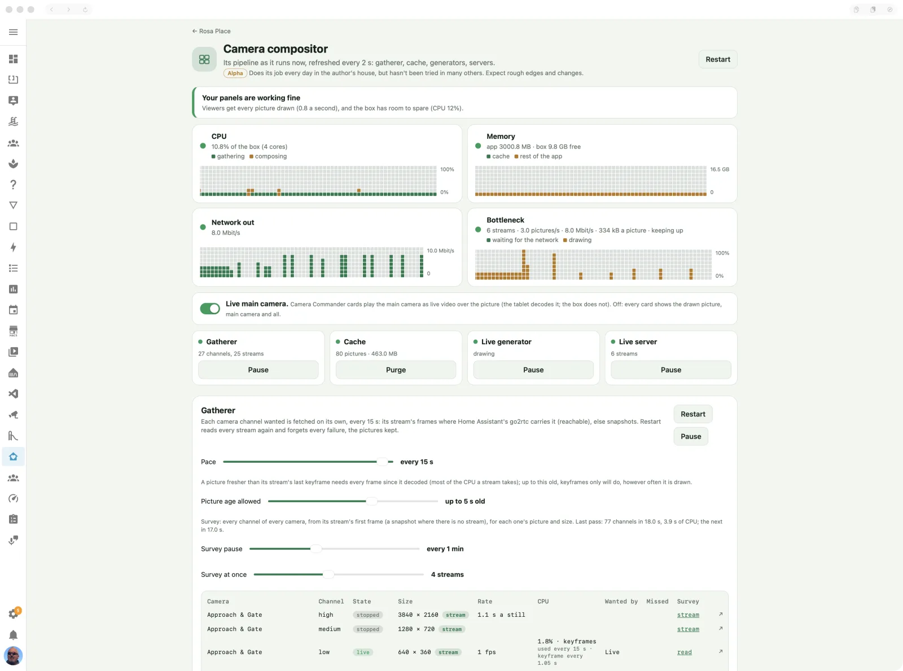

# Camera compositor

Draws the Camera Commander as one live picture for the dashboards and wall tablets.

> **Maturity: Alpha.** Does its job every day in the author's house, but hasn't been tried in many others. Expect rough edges and changes. ([The levels](../README.md#maturity))

## What it's for

A commander shows a dozen cameras at once. Played as a dozen live videos, that would sink a
wall tablet (each one decoding every stream) and the network (every stream to every tablet).
The compositor does the work once, on the box: it gathers each camera's newest picture,
draws each commander as a single picture at exactly the size each card asks for, and sends
that. A tablet shows one picture, every couple of seconds, whatever the number of cameras.

You don't set it up: the [Cameras](cameras.md) and [Camera Commander](camera-commander.md)
pages say what to draw. This page is where you watch it work, and tune it when the box or
the network is the limit.

## Switching it on

It runs whenever **Camera Commander** is on in the app's Configuration tab (Settings → Apps →
Casa Mia → Configuration). It serves its pictures on port 8099, so keep that port set on the
app's Network section.

It reads the cameras through Home Assistant's own go2rtc where it can (their streams), and
falls back to each camera's snapshots where it can't. Nothing else to install.

## On the page

The page refreshes itself every few seconds. **Restart**, at the top, stops the whole
compositor and starts it again: every picture on screen stops for a moment.

- **Health:** one sentence on how your panels are doing, and what to do about it: all well,
  nothing watching, the gatherer paused, streams failing, go2rtc out of reach, the CPU the
  limit (gathering or drawing), drawing behind, or the network the limit. It judges the last
  30 seconds, so one odd moment doesn't flip it. The integration's **Health** sensor carries
  the same, to automate on.
- **The graphs:** CPU (gathering and composing, as a share of the box), memory (the cache and
  the rest of the app), network out, and the bottleneck: whether viewers wait for the network
  or for the drawing.
- **Live main camera:** on, Camera Commander cards play the main camera as live video over
  the picture (the tablet decodes it, not the box). Off, every card shows the drawn picture,
  main camera and all.
- **The pipeline strip:** the stages in a row (gatherer, cache, generator, server), each with
  its state and a button to pause or run it.
- **Gatherer:** fetches each camera channel that is wanted, at its **pace** (0: as fast as
  each answers). **Picture age allowed** lets a stream decode keyframes only when a picture
  that old will do, which saves most of the CPU a stream takes. The **survey** looks at
  every channel of every camera in turn, for its picture and size, with a pause between
  passes and a number of streams at once. The table has a row per channel: its state, size,
  rate, CPU, who wants it, missed fetches, its last survey, and a live view. **Restart**
  reads every stream again and forgets every failure, keeping the pictures.
- **Cache:** every picture kept, each camera channel's newest and each drawn commander, as
  tiles or a list. Tap one for a live view; a bin purges it, **Purge all** purges the lot
  (each is fetched or drawn again).
- **Live generator:** draws each commander someone is watching, at its pace. A row per
  picture: the commander, its size (a card's, or the commander's own), when it was last
  drawn, how long that took, and its size in kB.
- **Live server:** sends each viewer the newest picture as it is drawn. A row per stream: the
  viewer (its address, with its name when it is a wall tablet Kiosk Satellites knows), the
  picture, the card's version, frames and pictures a second (sent of drawn), the
  rate, and how long sends wait for the network. **Size test** opens a commander at exactly
  your browser window's size.

### In Home Assistant

Casa Mia's **Camera compositor** device has the same controls, for automations: a switch per
stage (gatherer, live generator, live server) and **Live main camera**; the paces (gatherer,
live generator, survey pause, survey streams at once, picture age allowed); **Restart**,
**Restart gatherer** and **Purge cache** buttons; and the **Health**, **Cache pictures** and
**Cache size** sensors.

## Troubleshooting

Start with the health sentence: it names the problem and says what to do.

- **"Home Assistant's go2rtc is out of reach":** every camera is on snapshots. It is checked
  again every 10 seconds and comes back by itself (after Home Assistant restarts, say); if
  it doesn't within a minute, restart the Casa Mia app.
- **"Camera streams have failed":** restart the gatherer (here, or the **Restart gatherer**
  button). If they fail again, a channel's **Survey** column says why.
- **"The CPU is the bottleneck":** gathering: slow the gatherer's pace, or raise **Picture
  age allowed**. Drawing: slow the live generator's pace.
- **"Panels lag":** the network can't take the pictures as fast as they are drawn. Send less:
  a slower live generator pace, or a card's **Away sharpness** for viewers away from home.
- **A camera stays "(Waiting …)" in the cache:** it hasn't sent a first picture. Open its live
  view from the gatherer's table to see whether the camera itself answers.
- **Pictures don't change at all:** check the pipeline strip for a paused stage.
- **The log** says what the compositor does as it does it: each restart, each stream that
  fails and why, and each viewer that comes and goes.
