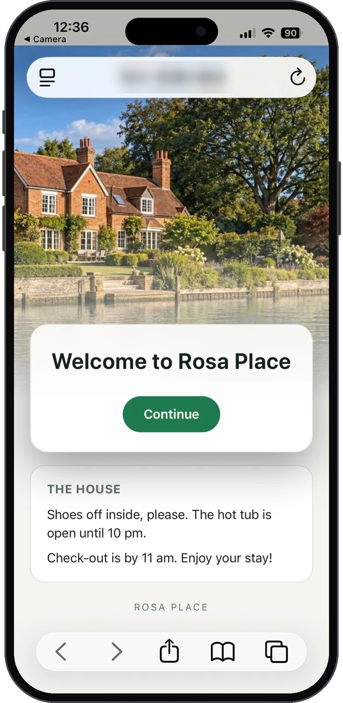
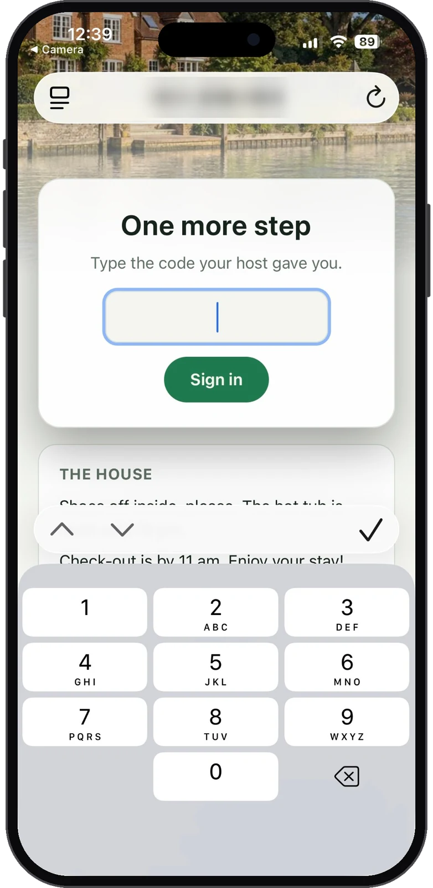
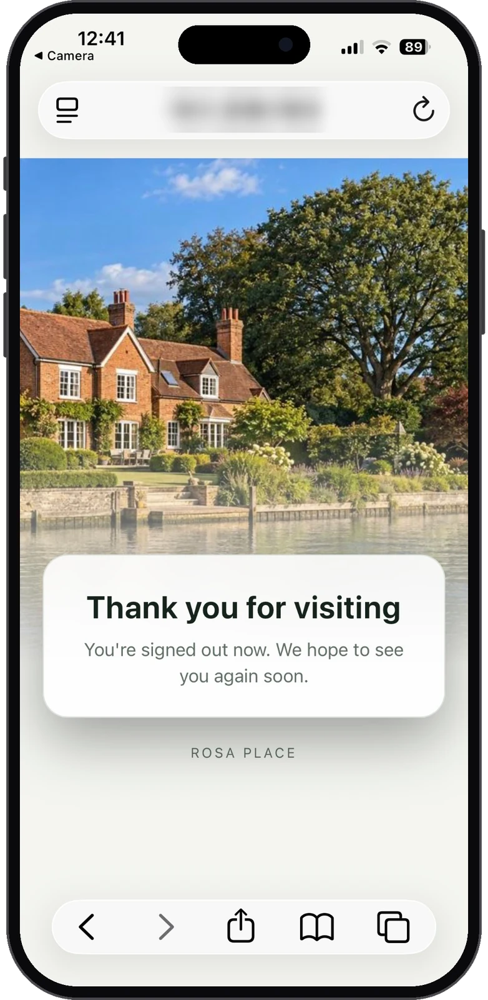
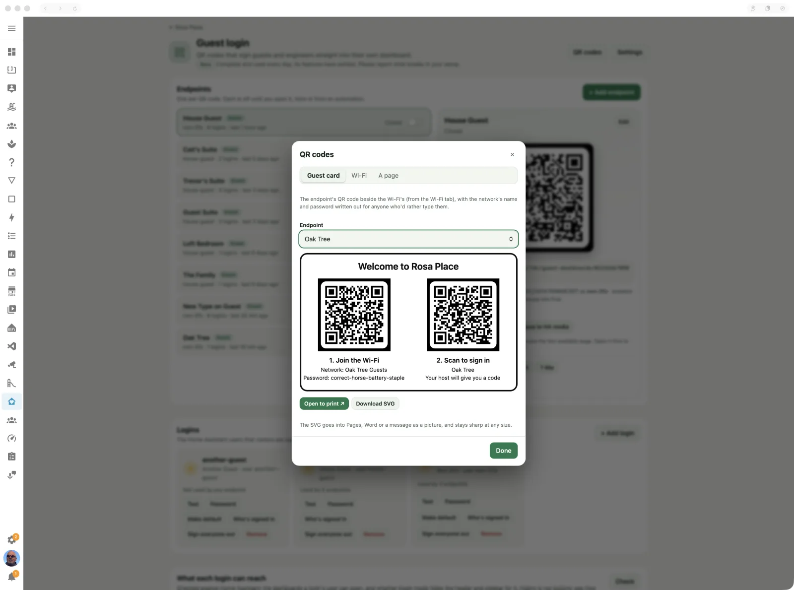
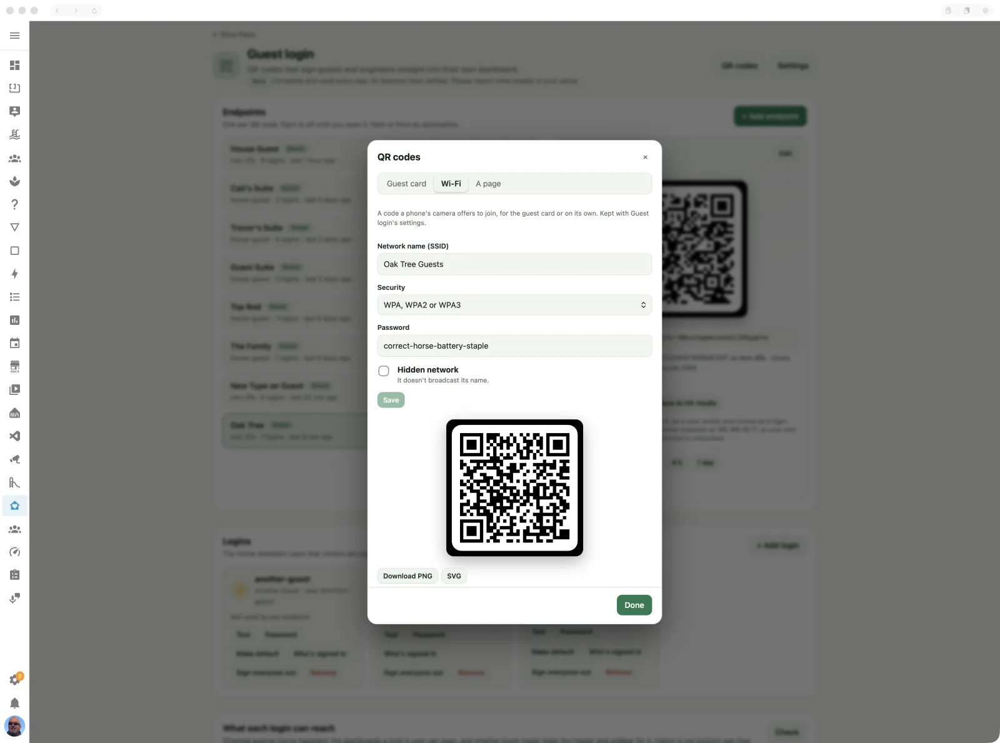
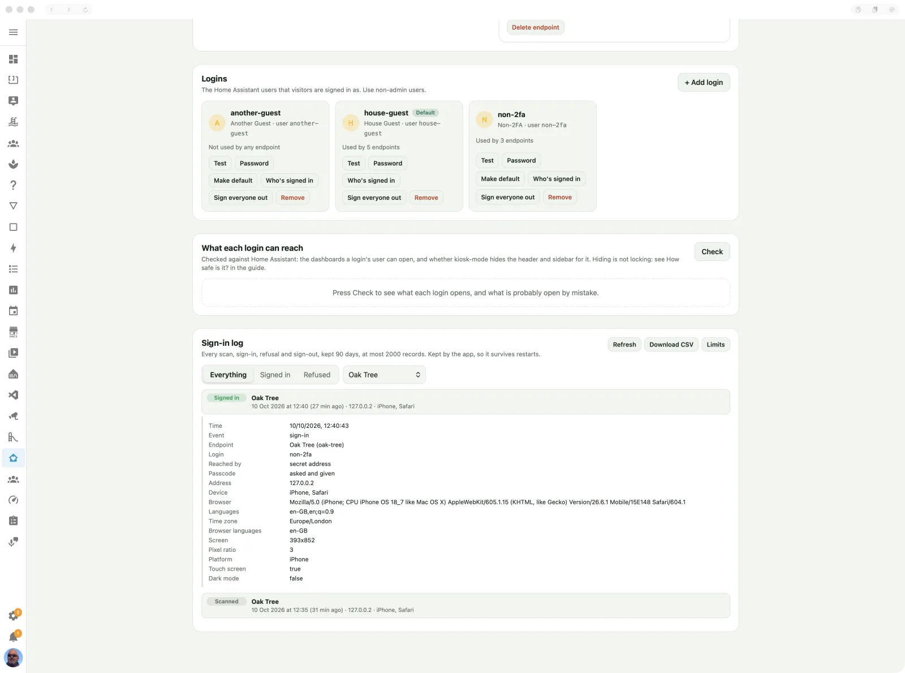

# Guest login

QR codes that sign guests and engineers straight into their own dashboard.

> **Maturity: Beta.** Complete and used every day; its features have settled. Please report what breaks in your setup. ([The levels](../README.md#maturity))


## What it's for

Visitors want the lights, the heating and the music in their room, and you don't want
them typing a password into a stranger's phone, or holding your own login. Guest login
gives each kind of visitor a QR code. They scan it, see a short welcome with your house's
photo, and land on the dashboard you chose for them, signed in as a Home Assistant user
you chose for them. The same works for an engineer: a code on the plant-room wall that
opens the heating dashboard and nothing else.

Every code is off until you open it. You can open one by hand, for a set time, or from an
automation, for example while a guest suite is booked. So a code that gets photographed
or passed on is only good while you leave it open. For a holiday let, add a passcode you
send with the booking, show your house rules before they sign in, and sign everyone out
when the booking ends; the sign-in log keeps a record of who came in and when.

It grew out of [ha-auto-guest-login](https://github.com/cnorick/ha-auto-guest-login) by
Nathan Orick, and it still answers QR codes printed for that app.

## Switching it on

1. Turn on **Guest login** in the app's Configuration tab (Settings → Apps → Casa Mia →
   Configuration), and restart the app.
2. Leave port **8675** open in the same tab's Network section: it's the address the QR
   codes point at.
3. Make sure visitors' phones can reach your Home Assistant box. The codes point at the
   box's address on your network, so a phone on mobile data, or on a guest Wi-Fi that
   can't see the box, gets nowhere. Once signed in, a visitor uses Home Assistant at the
   same address, as anyone in the house does.
4. Open **Guest login** in the Casa Mia panel and add a login, then an endpoint (below).
5. Install [kiosk-mode](https://github.com/NemesisRE/kiosk-mode) (from HACS) and hide the
   header and sidebar from the visitors' users, on Casa Mia's
   [Kiosk mode](kiosk-mode.md) page, or with **Check** under
   [What each login can reach](#what-each-login-can-reach). Without it, a visitor lands on
   your chosen dashboard but can open any other from the sidebar, and Settings too.

The **Casa Mia Guest Login** integration must be set up for the switches, the sensors, the
automation action and the guest's goodbye: once Casa Mia's own integration is set up and
guest login is on, it is offered under **Discovered** in Settings → Devices & services.
Without it the page still works, but you open and close codes only by hand.

## What the guest sees

<table>
<tr>
<td width="33%" valign="top">

<b>The welcome.</b> Your house, a welcome and, if you've written them, your house rules,
with <b>Continue</b> to sign in.
</td>
<td width="33%" valign="top">

<b>The passcode.</b> If the endpoint asks for one, the code you sent with the booking.
Two-factor sign-in asks the same way.
</td>
<td width="33%" valign="top">

<b>The goodbye.</b> When the endpoint closes and signs its visitors out, their page goes
here first.
</td>
</tr>
</table>

1. **The scan.** The phone's camera opens the endpoint's address. A closed or unknown
   endpoint shows a plain *Not available*, the same either way, so it gives nothing away.
2. **The welcome.** A *Guest* endpoint shows your house's photo, the welcome title and
   message, and signs in while it shows (for as long as the welcome delay). With **Show
   the house info first**, your house rules show under it and the sign-in waits for
   **Continue**. An *Engineer* endpoint shows a plain *Maintenance access* card instead and
   signs in at once.
3. **A code, if asked.** An endpoint with a passcode asks for it next: *Type the code
   your host gave you*, with a number pad when the passcode is all digits. A login whose
   user has two-factor sign-in asks for the authenticator app's code the same way. A wrong
   code can be tried again.
4. **Their dashboard.** The phone lands on the endpoint's landing dashboard, signed in as
   its login, and stays signed in like any Home Assistant phone.
5. **The goodbye.** When the endpoint closes and signs its visitors out, a page still
   open goes to the goodbye page (or the address you chose) within a second or two, or
   on the second a timed opening ends, and the sign-out follows 8 seconds after the
   close. A phone asleep at the time wakes to Home Assistant's login screen instead.

## On the page

Every change takes effect at once. There's no Save button and no restart.

### Endpoints

An endpoint is one QR code: a guest suite, the plant room, a KNX panel. Add one with
**+ Add endpoint** (after you've added a login):


- **Label:** its name, and the name of its device in Home Assistant (for example
  *Guest: Oak Tree*).
- **ID:** a permanent name for its entities. If you change it later, its entities are
  replaced.
- **Landing dashboard:** where the visitor lands once signed in. Pick any dashboard
  view, or type a path.
- **Type:** *Guest* shows the welcome page, with your house's photo. *Engineer* shows a
  plain *Maintenance access* page and goes straight on: for maintenance codes.
- **Login:** which login it signs in as, or the default.
- **Secret address:** the QR code points at `http://<your box>:8675/e/<secret>`. Anyone
  who has that address can sign in while the endpoint is open, so treat it like a
  password. **New** makes another, and every code printed with the old one stops working.
- **New secret address each time it closes:** so a code from a past visit is no good, for
  an engineer's code sent for one visit. Take the new QR code from the page before the
  next visit. A printed Legacy QR code keeps its address.
- **Legacy QR code:** answers codes printed for ha-auto-guest-login, at
  `http://<your box>:8675/?d=<dashboard>`. The landing dashboard must then match the old
  code's `d=` value exactly.
- **Ask for a passcode:** after the scan, the visitor types a code you gave them (with the
  booking, say) before they're signed in; a wrong one can be tried again, ten tries a
  minute. It never expires, so change it between guests. Digits only gives the visitor a
  number pad. Greyed out when the login's user has two-factor sign-in (its card shows
  **2FA**), which already asks for a code.
- **Sign its visitors out when it closes:** closing the endpoint, by hand, from an
  automation or when its time runs out, also ends every session of its login, so a guest
  still inside is signed out; their open pages go to the goodbye first (see
  [What the guest sees](#what-the-guest-sees)). Sessions belong to the login, not the
  endpoint: if another open endpoint uses the same login, they're kept until the last one
  closes, and then they end whichever endpoint that is, as long as one of the login's
  endpoints has this ticked. Home Assistant can't tell two endpoints' visitors apart: give
  each endpoint its own login if that matters. On by default for a new endpoint.
- **Show the house info first** (guests only): the house rules from **Settings** show
  under the welcome card, and the visitor presses **Continue** to sign in.
- **Own welcome page:** a title, message and delay for this endpoint only. Otherwise it
  uses the ones in **Settings**.

Each endpoint's row shows its login, how many times it has been used and when last, and
its switch: *Open*, *Open until* a time, or *Closed*. Pick one to see its QR code and
details (its landing dashboard and login, its passcode, what closing it does), and from
there:
- **Download** the code as PNG or SVG to print, or **Save to HA media**, which saves it
  for a picture card on a dashboard (the media address is copied, ready to paste);
- **Try it ↗**, which runs the whole sign-in as a scan would. When it can, it uses
  another of the box's names, so your own login in this browser is left alone. If it
  can't, it says so: use a private window;
- **Open** it, or **Open for** 1 h, 4 h or 1 day; **Close now**;
- **Delete endpoint**, which stops its code working and removes its device from Home
  Assistant.

### Logins

A login is the Home Assistant user a visitor is signed in as. Add one with **+ Add login**:

- **Existing Home Assistant user:** pick the user, then type that user's current
  password. Casa Mia signs visitors in with it.
- **New user:** Casa Mia creates a normal (non-admin) user that can log in only from your
  home network. Nobody has to type its password, because the QR code does the signing in.

Use a non-admin user. Visitors get whatever that user can do, and the page warns you when
you pick an administrator. Read [How safe is it?](#how-safe-is-it) before you choose.

Each login has these buttons:
- **Test** signs in with the stored password and says whether Home Assistant accepted
  it.
- **Password** changes the stored password, and, if you tick the box, the user's password
  in Home Assistant too.
- **Make default** sets the login used by every endpoint that doesn't name its own.
- **Who's signed in** shows how many phones and browsers are signed in as the login, each
  with its address and when it was last used. Home Assistant shows a user's sessions only
  to that user, so Casa Mia signs in as the login to look, then ends that sign-in again.
  It can't look at a login with two-factor sign-in.
- **Sign everyone out** ends every session of the login's user at once: each phone
  signed in with it is back at Home Assistant's login screen. (Not offered for an
  administrator: it would sign your own household out.)
- **Remove** forgets the login. The Home Assistant user itself is kept.

**Two-factor sign-in.** If the login's user has two-factor authentication (an
authenticator app, in the user's Home Assistant profile), a scan asks for the code before
it signs anyone in, and the login's card shows **2FA**. Use it for codes that stay on a
wall, such as an engineer's code on the heat pump door: the engineer phones you, and you
read them the code. A wrong code can be tried again; after five minutes the visitor has
to scan again. To set it up, sign in to Home Assistant as that user (a private window),
open its profile, and enable **Authenticator app** under *Multi-factor authentication
modules*.

### Settings

The **Settings** button holds:
- the welcome page's title, message and delay (0 to 30 seconds; the sign-in runs during
  it), with a **Preview** on a phone, a small phone or a tablet;
- **Host in QR codes**, the address phones reach the box on. Leave it empty to use the
  address found automatically. If you change it, every QR code changes, including the
  printed ones;
- **Goodbye:** a title and message for the page a signed-out visitor sees, or an address
  to send them to instead (your house's website, say);
- **House info:** your house rules (plain text; a blank line starts a paragraph), for
  endpoints that show them. (No Wi-Fi details: a phone that can open the welcome page is
  already on your network. The guest card carries the Wi-Fi.)


### QR codes

**QR codes**, at the top, makes the codes beyond each endpoint's own:



- **Guest card:** an endpoint's QR code beside your Wi-Fi's, *1. Join the Wi-Fi* and *2. Scan
  to sign in*, with the network's name and password written out for anyone who'd rather
  type them, and *Your host will give you a code* when the endpoint asks for one. **Open
  to print** shows it on its own page, ready to print; **Download SVG** gives a picture
  that stays sharp in a document or a message.
- **Wi-Fi:** your network's name, password and security, saved with Guest login's
  settings. Its QR code is one a phone's camera offers to join; download it on its own if
  you like.
- **A page:** a QR code for any dashboard or view, to download or save to Home Assistant's
  media. It's a plain link to the page, at the host in QR codes: it signs nobody in, so
  it's for a phone that's already signed in, such as a guest's, to jump to the pool's
  dashboard from a card by the pool.



### What each login can reach

*A screenshot of this is coming soon.*

**Check**, near the bottom of the page, asks Home Assistant what each login's user can get
to, and flags what is probably open by mistake:
- an administrator, a user that can sign in from outside your network, or a login shared
  by several endpoints;
- kiosk-mode not installed, or not hiding the header and sidebar for that user on the
  dashboard an endpoint lands on;
- the other dashboards that user can open by their address, and which are in its sidebar.

Where Casa Mia can put a problem right, the flag has a button:
- **Local only:** the user can then sign in only from your network;
- **Hide them for this user:** adds the user to kiosk-mode's settings on that dashboard,
  hiding the header and sidebar for them, and leaving the rest of its kiosk-mode settings
  as they were;
- **Admin only**, on each dashboard in the list that no endpoint lands on: only
  administrators can then open it. That's every non-admin user, your household's too.

Each asks first. It changes Home Assistant itself, so if that dashboard or user is open in
an editor elsewhere, unsaved changes there may be lost, or saving them may undo the fix.

Each login's card lists every dashboard and view its user can open. Remember that Home
Assistant's sidebar and a view's *Visible* setting only hide: any dashboard that isn't
admin-only opens for every user who types its address. Make the ones visitors mustn't see
admin-only (Settings → Dashboards → the dashboard → *Admin only*).

### Sign-in log

At the bottom of the page: every scan of a QR code and what came of it, and every
sign-out, newest first.



- **What each record holds:** the time; what happened (*Scanned*, *Signed in*, *Refused* with
  the reason, such as a wrong passcode, a closed endpoint or an unknown address, *2FA asked*,
  *Signed out*); the endpoint and login; how it was reached (secret address or printed QR);
  whether a passcode or a two-factor code was given; the phone's address; its browser, as
  a device ("iPhone, Safari") and in full, with its languages, time zone, screen size and
  whether it's in dark mode; and, when a device tracker in Home Assistant has that address
  (a router integration's, say), the tracker, its MAC address and the person it belongs
  to. Tap a record to see all of it.
- **Filter** by outcome (signed in, refused) or endpoint; **Download CSV** gives every
  record for a spreadsheet.
- **Limits** sets how long records are kept (90 days to start with) and how many at most
  (2000): older ones go at once, and from then on as they age.
- It's kept by the app in its own file (`guest-login-audit.jsonl`, beside its settings),
  not in Home Assistant's log, so it survives restarts and updates, and is in the app's
  backups. Passcodes, 2FA codes and secret addresses are never recorded: an unknown
  address is only said to be unknown.

### In Home Assistant

Each endpoint is a device, *Guest: Oak Tree* or *Engineer: Plant room*, with:
- an **Access** switch that opens and closes it;
- a **Login** event that fires at each sign-in, with the phone's address;
- **Logins** and **Last login** sensors.

**Open for a time** (`casa_mia_guest_login.enable_for`) opens an endpoint, then closes it again after
a number of minutes. For example, in an automation that runs when a booking starts:

```yaml
action: casa_mia_guest_login.enable_for
target:
  entity_id: switch.guest_oak_tree_access
data:
  minutes: 240
```

## How safe is it?

Think of a guest or engineer code as **handing someone a non-admin login to your Home
Assistant**, because that's what it does. The dashboard they land on, and kiosk-mode
hiding the header and sidebar, only decide what they *see*. That's hiding, not security.

A signed-in visitor holds a real Home Assistant session. Anything Home Assistant lets a
non-admin user do over its API, they can do: read every entity's state, and call services
such as unlocking a door or opening the garage, with their own tools rather than your
dashboard. Home Assistant can keep dashboards from a user (admin-only dashboards, views
shown only to some users), which is worth doing, but it has no way today to limit a user
to some entities or services. So:

- **Hand codes only to people you'd trust in your house anyway.** They're standing in it.
- **Keep codes closed** unless someone needs them: open them for a time, or from an
  automation while a booking lasts. A closed code signs nobody in.
- **End sessions when a code closes.** Closing an endpoint stops new sign-ins. Tick **Sign
  its visitors out when it closes** to throw out the phones already in, or press **Sign
  everyone out** on the login.
- **A login each** keeps endpoints apart: one guest suite's visitors can then be signed out
  without the other's, and kiosk-mode and views can tell them apart.
- **A passcode** for a code you hand out with a booking, **two-factor sign-in** for codes
  left on a wall, and a **new secret address on each close** for codes handed out per
  visit.
- **Leave secret addresses unprinted** where strangers pass, and press **New** if one
  leaks.
- **Press Check** under *What each login can reach* after any change to your dashboards,
  and read the **sign-in log** now and then.

### The thinking behind it

Two xkcd comics are the reason guest login works the way it does.

[Password Strength](https://xkcd.com/936/) (*correct horse battery staple*): a password
people must remember and type ends up either weak or written down. So nobody types
anything. The QR code carries a long random address that no one has to remember, read out
or type into a stranger's phone, and the Home Assistant password behind it never leaves
the box. Where a person does have to type something, the passcode, it's short on purpose,
and it's the endpoint's opening hours that keep it safe, not its length.

<a href="https://xkcd.com/936/"></a>

[Security](https://xkcd.com/538/) (*the $5 wrench*): real attacks go round the crypto,
not through it. Nobody will crack your secret address; a charming guest will ask for the
code again, or a photo of the card will get passed on. So the effort goes into limiting
what a code is worth once it's out: closed until you open it, open only for a booking,
its visitors signed out when it closes, a new address for each visit, and a sign-in log
that says who came in and when. It doesn't go into making the code itself harder to break.

<a href="https://xkcd.com/538/"></a>

*Comics by Randall Munroe, [xkcd.com](https://xkcd.com), under
[CC BY-NC 2.5](https://creativecommons.org/licenses/by-nc/2.5/).*

### How far can a session be narrowed?

We looked at what Home Assistant offers for keeping a signed-in visitor to what they
need:

- **A user per endpoint:** worth it, and free. Sessions can then be ended per endpoint,
  kiosk-mode and a view's *Visible* setting can differ per suite, and the logbook says
  which suite did what.
- **Local only:** worth it. A user that can log in only from your network can't use a
  leaked session from outside. Users Casa Mia creates are made this way; the check flags
  one that isn't.
- **Admin-only dashboards:** worth it. They are the only dashboards a non-admin can't
  open by address.
- **Limiting entities or services per user:** Home Assistant offers no way to set this in
  its interface: a user is an administrator or not. So nothing stops a visitor's tools
  calling a service on any entity.
- **A proxy in front of Home Assistant** that passes only the visitor's own dashboard's
  calls: possible in principle, but every dashboard card and every future Home Assistant
  release would have to be followed, and a mistake would fail open. Not worth its cost
  for visitors you've let into your house.

So the practical limits are: non-admin, local only, a login each, closed when not
needed, and signed out when closed. Beyond that, treat a code as a key to the house.

## Troubleshooting

Start with the **sign-in log** on the Guest login page: it says what became of every
scan. The app's log (Settings → Apps → Casa Mia → Log) adds why, and what to change.

- **The phone shows "Not available."** The endpoint is closed, or the address names no
  endpoint. The two look the same to the visitor on purpose. The sign-in log says which
  (*endpoint closed*, *unknown secret address*), and the app's log has a line
  `guest login refused <address>: …` naming the endpoint. Open the endpoint, or check that
  the printed code's secret address matches the endpoint's.
- **An old printed code doesn't work.** Tick **Legacy QR code** on the endpoint, and make
  its landing dashboard exactly the code's `d=` value. The log says *does not answer
  legacy QR codes* when that's all it needs.
- **The phone never reaches the page.** The phone can't reach the box at the address in
  the code. Check the phone is on your home Wi-Fi, that the guest network can reach the
  box, and **Host in QR codes** in Settings.
- **The welcome shows, then signing in fails.** Press **Test** on the endpoint's login.
  The log names the reason, for example *Home Assistant rejected user …* (the password
  changed in Home Assistant: set it again with **Password**) or *login … does not exist*.
- **"That code did not work."** The sign-in log shows *bad passcode* (the endpoint's
  passcode: check it on the endpoint) or *bad code* (two-factor: the authenticator's
  newest code). After five minutes waiting for a two-factor code, the visitor scans again.
- **Too many tries.** One address gets 10 tries a minute, then has to wait.
- **The guest isn't sent to the goodbye.** The goodbye needs the Casa Mia Guest Login
  integration (and a Home Assistant restart after an update that changes it), an
  endpoint of that login with **Sign its visitors out when it closes** ticked, and the
  guest's page open: a phone asleep at the time wakes to Home Assistant's login screen.
- **Who's signed in can't look.** The login has two-factor sign-in (Casa Mia has no code to
  sign in with), or its password no longer works: press **Test**.
- **A screenshot shows real names.** Turn on the screenshot swap and add the names to its
  `swap.json`: QR codes, the guest card and the welcome page then show the stand-ins.
- **At start-up,** the log lists each endpoint, how it's reached and its landing
  dashboard, with a **PROBLEM** note on any that can't work, such as one with neither a
  secret address nor Legacy QR code.
