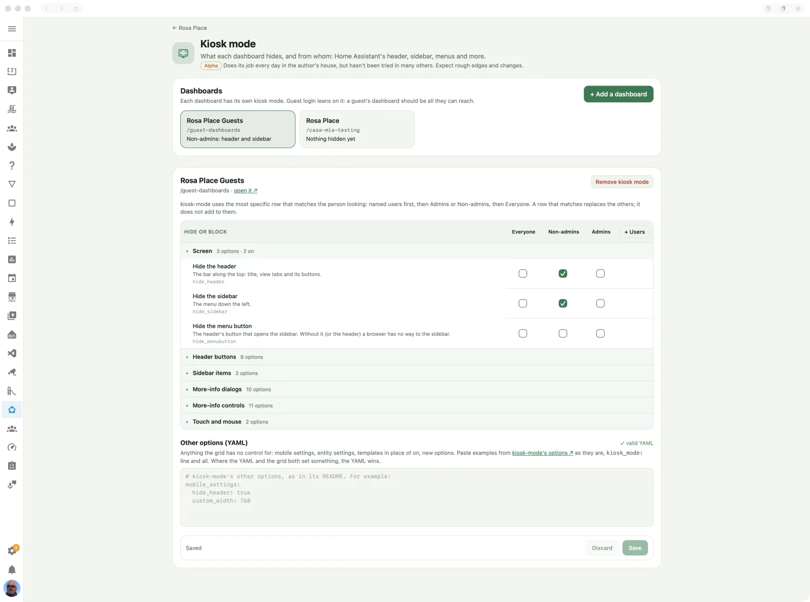

# Kiosk mode

What each dashboard hides, and from whom: the header, sidebar and more, through kiosk-mode.

> **Maturity: Alpha.** Does its job every day in the author's house, but hasn't been tried in many others. Expect rough edges and changes. ([The levels](../README.md#maturity))

## What it's for

Keep a wall tablet or guest dashboard focused on its controls: hide the header,
sidebar, menus or parts of the more-info dialogs. Casa Mia gives you a grid of
[kiosk-mode](https://github.com/NemesisRE/kiosk-mode)'s settings for each dashboard,
with different choices for administrators, non-admins and named users.

This changes what people see and can press in the browser. It does not restrict their
Home Assistant session's API permissions. For guest access, read
[How safe is it?](guest-login.md#how-safe-is-it).

## Switching it on

The Kiosk mode page is always available in Casa Mia; there is no app option to enable it.

1. Install **Kiosk Mode** through HACS, or follow its
   [manual installation instructions](https://github.com/NemesisRE/kiosk-mode#installation).
   **Casa Mia does not install it.**
2. Open **Kiosk mode** in the Casa Mia panel. It checks the dashboard resources for
   kiosk-mode and shows a warning if it cannot find it.
3. Press **+ Add a dashboard** and choose the dashboard and who should have its header
   and sidebar hidden. Press **Add** to apply that initial choice.

Use a dashboard you manage through Home Assistant's editor. YAML dashboards are read
only here; edit their files instead. For an automatically generated dashboard, use
**Edit dashboard → Take control** before adding kiosk-mode.

## On the page

### Dashboards

The cards show dashboards that already contain kiosk-mode settings, with a summary of
what is hidden and from whom. Select one to edit it. Adding kiosk mode offers a starting
choice for hiding the header and sidebar, or hiding nothing initially.

### The settings grid

Options are grouped into **Screen**, **Header buttons**, **Sidebar items**,
**More-info dialogs**, **More-info controls**, and **Touch and mouse**. Tick the things
that should be hidden or blocked in the appropriate column:

- **Everyone** supplies the general choice.
- **Non-admins** or **Admins** supplies the choice for that role.
- **+ Users** adds a column for selected users by name. Click its heading to change the
  names or remove that column.

The most specific matching choice wins: named users, then their role, then Everyone.
It replaces the broader choice rather than adding to it. If you hide the sidebar for
Everyone but add a column for Ann, tick Hide the sidebar in Ann's column as well if she
should still have it hidden.

Changes to the editor wait for **Save**. **Discard** returns to the saved choices.
**Remove kiosk mode** removes the dashboard's settings, bringing back what they hid.
Refresh that dashboard's screens after saving, unless the dashboard reload helper does
it for you.

### Other options (YAML)

Use this box for mobile settings, entity settings, templates and options without a grid
control. You can paste a block with its `kiosk_mode:` heading. The page checks YAML
syntax as you type and disables **Save** while it is invalid. Valid YAML does not prove
that an option is supported by your installed kiosk-mode version; use
[kiosk-mode's option reference](https://github.com/NemesisRE/kiosk-mode#config-options).
Where the YAML and grid set the same option, the YAML wins.

## In Home Assistant

Settings are saved in each dashboard's own configuration. There are no extra switches
or sensors for this editor, and installing Casa Mia does not replace the kiosk-mode
resource.

Kiosk Satellite also has its own kiosk controls. If a tablet hides something differently
from your browser, check its settings as well as this dashboard's configuration.

## Troubleshooting

- **The tile says Needs setup, or the page says kiosk-mode was not found.** Install
  kiosk-mode and check its dashboard resource. If you load it through
  `extra_module_url`, it can work while this page still cannot detect it.
- **Saved settings have no visible effect.** Refresh the dashboard, check that the
  resource loaded, and check the column matching the signed-in user. Other options
  (YAML) can override a grid tick.
- **A dashboard cannot be edited here.** A YAML dashboard must be changed in its file.
  An automatic dashboard must first be taken under your control. The page explains
  which applies.
- **Home Assistant cannot be asked or refuses a save.** Check the app's log for
  `kiosk mode: cannot look at the dashboards` or `kiosk mode: cannot save dashboard`.
  The page also shows the Home Assistant error; restore that connection before retrying.
- **All touch and mouse input is blocked.** The Block all touch and mouse option is
  meant for an untouched display. Add `?disable_km` before the address's `#` fragment
  (or `&disable_km` if it already has a query), reload, and undo the setting.
