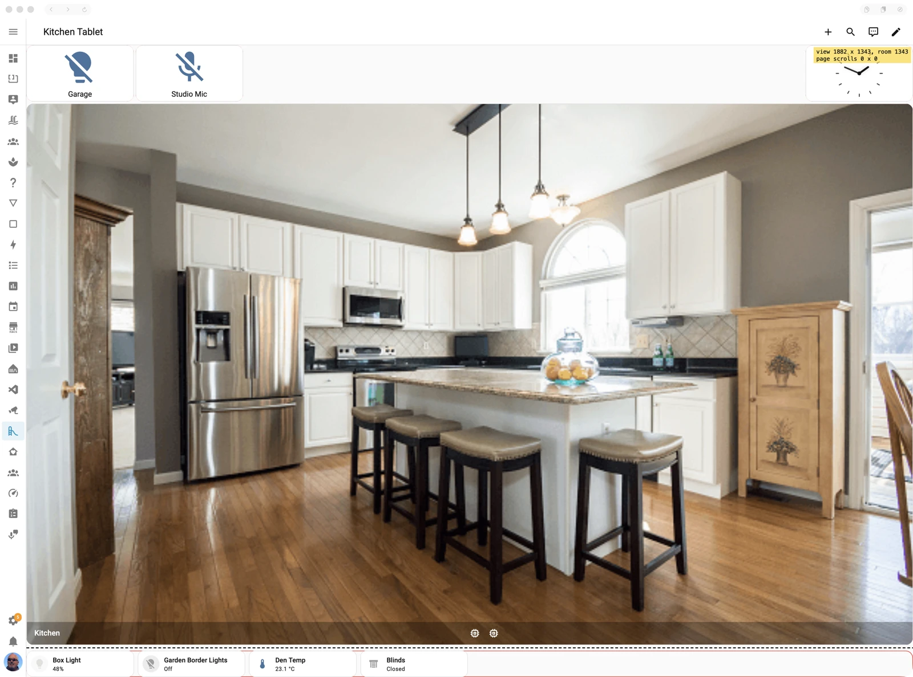

# Settings

Settings with no other home, behind the cog by the house photo.

## What it's for

Set the dashboard helpers once for the home, rather than adding copies to each
individual dashboard. The same page holds the optional aids for finding
[Tablet Layout](../tablet-layout.md) sizing problems.

## Switching it on

Open the cog beside the house photo on [Home](home.md). The Settings page needs no
module switch. The Casa Mia integration must be installed to load the helpers and
pass the layout settings to dashboards.

For the debugging section, turn on **Developer mode** in Settings → Apps → Casa Mia
→ Configuration, save, and restart the app. With Developer mode off, these aids do
not appear on tablets, even if their switches were previously saved as on.

## On the page

### Dashboard helpers

These scripts are loaded into Home Assistant pages for every user and device.
Switches save immediately. Home Assistant loads a change within a minute; open pages
receive the changed scripts on their next reload.

- **Reload dashboards when they change:** an open dashboard reloads when it is saved,
  so a wall tablet picks up the new dashboard without someone tapping Refresh. It
  does not reload a dashboard while it is being edited. Remove a manually added
  `auto_refresh.js` dashboard resource when switching this on.
- **Back button helper:** a dashboard button navigating to `#BACK` behaves like the
  browser's Back button. Remove any manually added `nav_back_helper.js` resource
  first; two copies can go back twice.
- **Keep camera pictures live:** stops supported camera streams on pages not on screen
  and restarts those shown, so returning to a page gives a live picture. It also
  makes the generated camera dashboard's main-camera highlight pulse. It starts on
  for a fresh configuration.

### Dashboards

- **Enable garnish on all section dashboards:** brings the Tablet Layout's garnish to every
  section of every Sections dashboard. Home Assistant already hides a section whose cards
  are all hidden, and its room goes to the others; garnish (a heading over some conditional
  cards, say) never keeps a section showing, so a section left with only garnish hides too.
  In edit mode each card in a section has a sprig on its corner: tap it to make the card
  garnish. Open dashboards follow the switch within a few seconds. Off (the default),
  garnish works only in a Tablet Layout. See
  [Garnish](../tablet-layout.md#showing-and-hiding).

### Tablet Layout debugging

These settings affect **every Tablet Layout**, on every browser and tablet while
Developer mode is enabled, not only the view you are editing.

- **Identify sections panels:** draws an outline around each panel so its edges are
  visible.
- **Outline (CSS):** sets the outline, for example `1px solid red`. It saves when you
  leave the field or press Enter; an empty value returns to that default.
- **Show the view size:** shows a translucent yellow label at the top right, with the
  view's size, available room below its top, and remaining scrolling. A layout that
  fits the screen should show scrolling of `0 x 0`.

Layout aids update on open views within a few seconds. Turn them off here when you
finish, or disable Developer mode to hide all of them while retaining your choices.

## In Home Assistant

These are app settings applied by the integration, not separate switch entities. The
helpers cover all users and devices, so test their effect on your everyday dashboards
as well as your tablet.

## Troubleshooting

- **Developer options are missing.** Enable Developer mode in the app's Configuration
  tab and restart it. The normal dashboard helpers are available without that mode.
- **A helper change has not appeared.** Allow up to a minute for Home Assistant to
  pick it up, then reload the dashboard. Check the Casa Mia integration is connected.
- **Back jumps two pages or dashboards reload twice.** Remove the manually installed
  helper resource before enabling Casa Mia's copy.
- **Outlines or the size label are everywhere.** Their scope is every Tablet Layout.
  Switch them off here, or turn off Developer mode and restart the app.
- **The outline does not show.** Check Identify sections panels is on, Developer mode
  is on, and the Outline field contains valid CSS.
- **Saving fails.** The page shows an error. The app log records requests to
  `/api/settings/` and changed values as `setting helpers.…` or
  `setting tablet_view.…`. Home Assistant logs `dashboard helpers changed in the app`
  when it reloads to pick up a helper change. A successful app save
  followed by no dashboard change points to the integration or an old open page.
