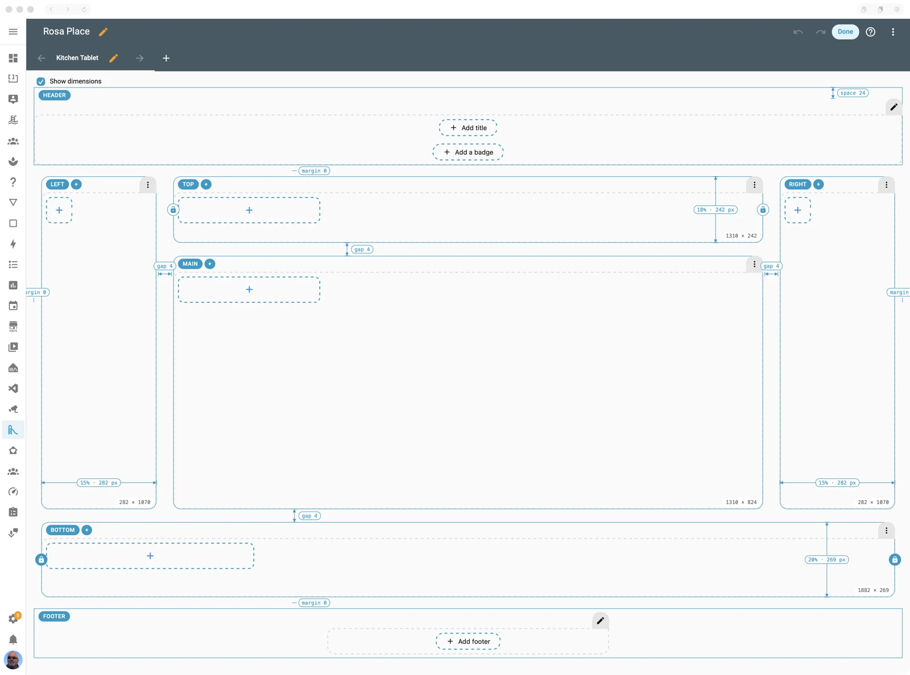
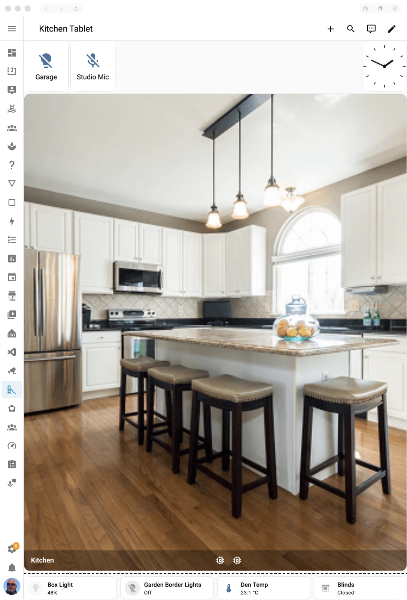
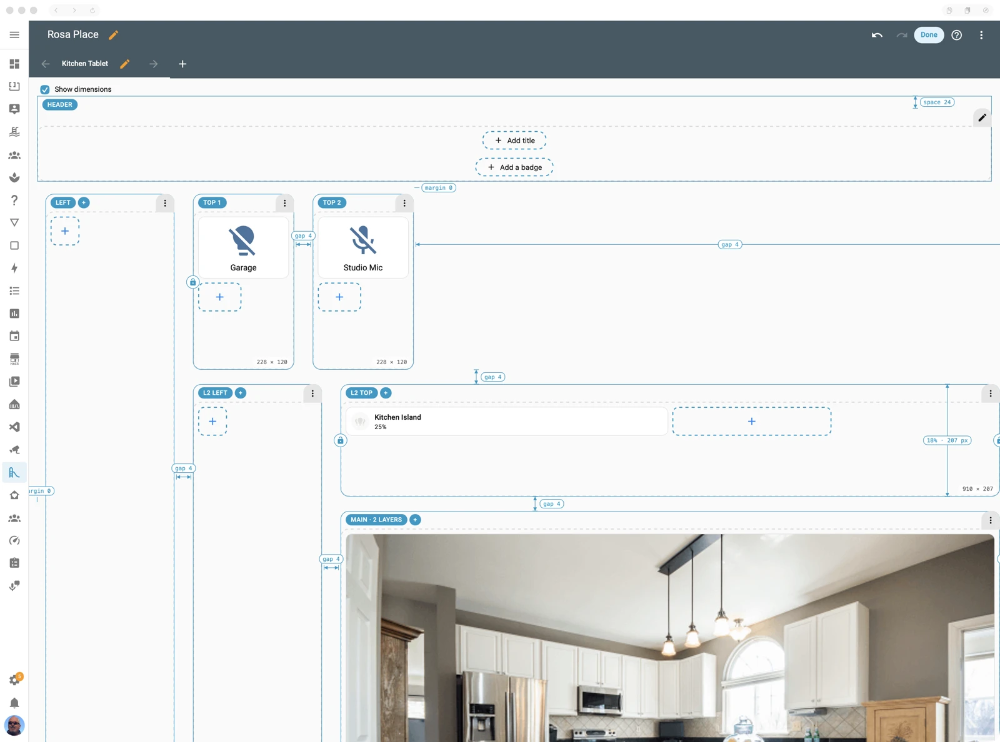
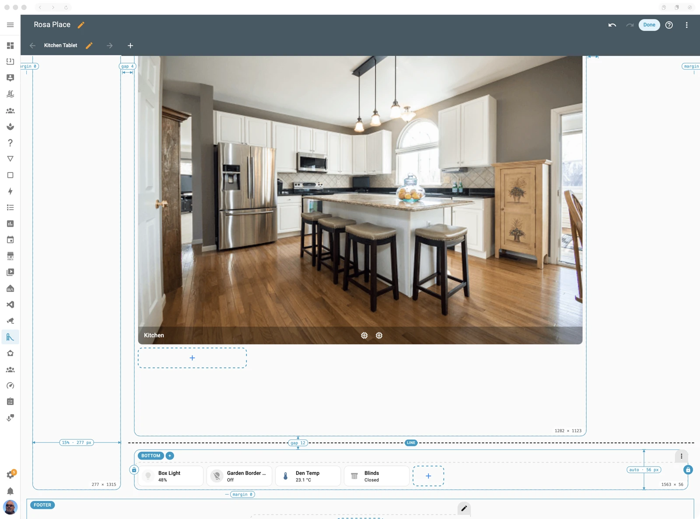
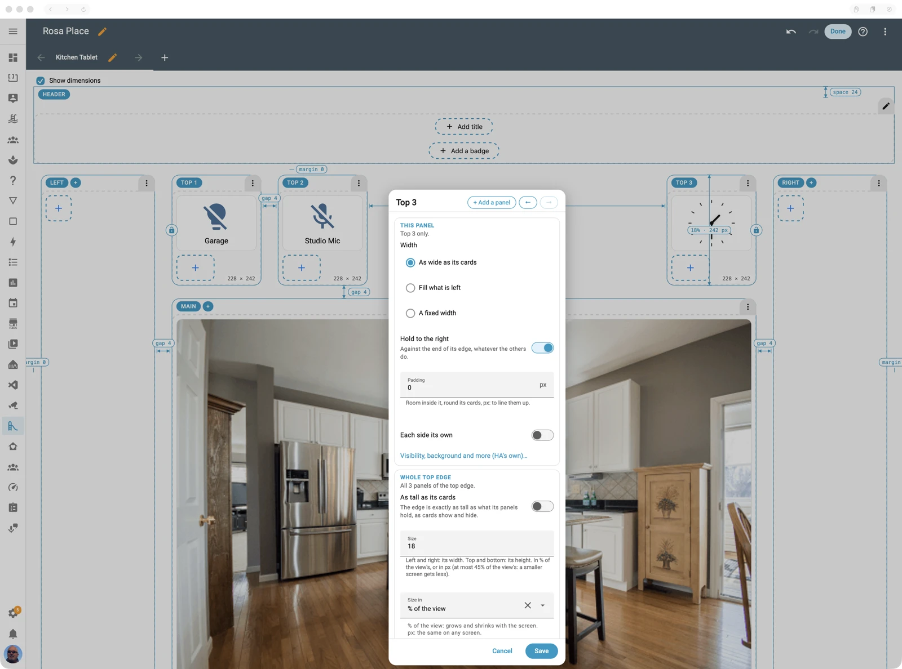
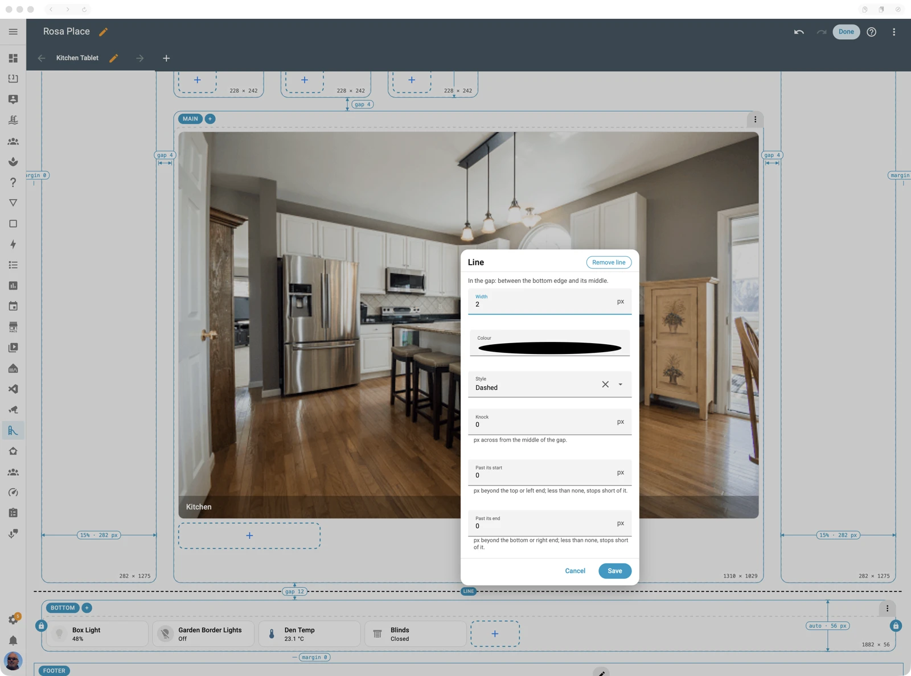
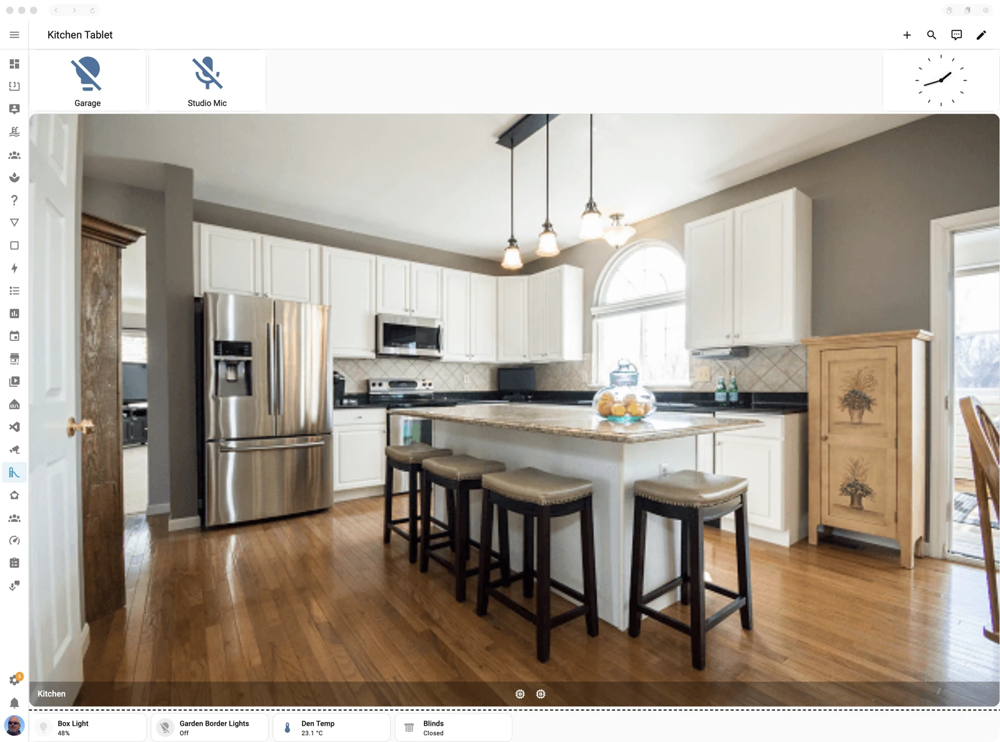
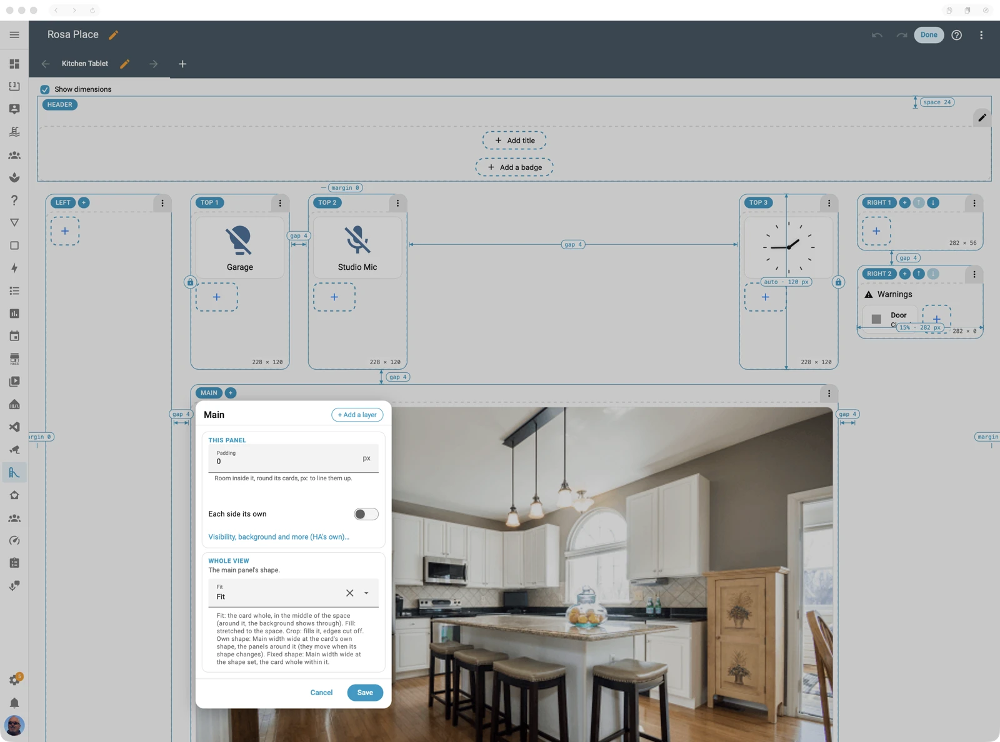

# Tablet Layout

A Home Assistant view that fits the screen exactly. No scrolling, nothing hanging off the
edge, on any tablet, phone or desktop, in portrait or landscape.



It *is* Home Assistant's own Sections view, so the header, footer, badges, sections, cards,
visibility conditions and card editors all work as you know them. What it adds is the
arrangement: its sections become **panels** round a **main** panel, sized to the screen,
and the whole view is locked to the screen's size. Make the screen bigger or smaller and the
panels grow and shrink with it; show or hide a card and the panels make room or close up.

If you've ever spent an evening nudging `card-mod` CSS so a wall tablet's dashboard *just*
fits, and then a card appeared under a condition and the page started scrolling again,
this is what it's for.

**The same view on three screens.** Nothing was changed between these: the view simply fits.

<table><tr>
<td width="40%" valign="top"><br>A tablet, landscape.</td>
<td width="25%" valign="top"><br>Portrait.</td>
<td width="35%" valign="top"><br>A wide desktop window.</td>
</tr></table>

**Contents:** [Getting started](#getting-started) ·
[Panels, edges and layers](#panels-edges-and-layers) ·
[Sizing an edge](#sizing-an-edge) · [Panels along an edge](#panels-along-an-edge) ·
[Spacing and lines](#spacing-and-lines) · [Showing and hiding](#showing-and-hiding) ·
[One card filling a panel](#one-card-filling-a-panel) · [The main panel](#the-main-panel) ·
[Header and footer](#header-and-footer) · [Edit mode](#edit-mode) ·
[Options reference](#options-reference) · [Debugging](#debugging) · [Examples](#examples)

## Getting started

You need the Casa Mia integration installed (it loads the view into every Home Assistant
page). Then:

1. Open a dashboard, enter edit mode, and add a view (or edit one).
2. Set **View type** to **Tablet (Casa Mia)**.
3. Save, and enter edit mode on the view. You get a main panel with a top, left, right and
   bottom edge round it, each with an empty section, named on its chip.
4. Add cards to the panels as you would in any Sections view.


That's a working layout. Every edge starts at a share of the screen (left and right 15% of its
width, top 18% and bottom 20% of its height) and the main panel takes what's left. An
edge with nothing in it takes no room, so a layout with cards only in main and the bottom
edge is simply a main area over a strip.

In YAML, the view is:

```yaml
type: custom:casa-mia-tablet-layout
title: Kitchen
layout:            # the view's layout options; left out, the defaults
  gap: 8
sections:
  - type: grid
    view_layout: { panel: main }
    cards: [...]
  - type: grid
    view_layout: { panel: bottom }
    cards: [...]
```

Everything in `layout:` and each section's `view_layout:` is set on the edit surface; you
never need to write it by hand, but it's all plain YAML if you want to.

## Panels, edges and layers

**Main** is the panel in the middle. Round it are four **edges**: `top`, `left`, `right` and
`bottom`. Each section names its panel in `view_layout`:

```yaml
view_layout: { panel: top }
```

**Several sections can share an edge.** They sit in it as a stack of panels: side by side in
the top and bottom edges, one under the other in the left and right. A top edge with a
clock, the weather and the alarm, each its own section, is three panels in one edge.

**Layers nest like an onion.** Layer 1's edges surround a middle; layer 2's edges sit
*inside* that middle, round a smaller one; and so on, up to four layers, with main
innermost.

```yaml
view_layout: { panel: right, layer: 2 }
```

```
┌──────────────── top (layer 1) ────────────────┐
│ left │ ┌──────── top (layer 2) ────────┐ │ right │
│      │ │ left │      main      │ right │ │       │
│      │ └──────── bottom (layer 2) ─────┘ │       │
└─────────────── bottom (layer 1) ──────────────┘
```



In edit mode a layer's panels are named on their chips (*L2 TOP*), main says how many layers there are, and the view grows outwards to make room, so it scrolls.

Use a second layer when you want something to sit *between* the outer edges and main: a
status strip that spans only the width of the camera picture, say, while the outer left edge
runs the full height of the screen.

The view's own `layout:` holds layer 1's edges; each further layer's are in `inner:`, one
inside the last:

```yaml
layout:
  bottom: { size: 12 }        # layer 1's bottom edge
  inner:
    top: { size: auto }       # layer 2's top edge
```

> A view made before panel stacks existed, with no `view_layout: {panel}` on its sections,
> still works: its first five sections are main, left, top, right and bottom, in that order.

## Sizing an edge

An edge's depth is how tall it is (top, bottom) or how wide (left, right). Set it on the
edge, for every panel in it:

| Setting | What it means |
|---|---|
| `size: 18` (with `unit: "%"`, the default) | A share of the view's height (top, bottom) or width (left, right). Grows and shrinks with the screen. |
| `size: 120` with `unit: px` | Fixed, the same on any screen, but never more than 45% of the view: a small screen gets less. |
| `size: auto` | **As its cards.** The edge is exactly as tall (or wide) as what its panels hold, and follows them as cards show and hide. The usual choice for a strip of tiles or buttons. |


Changing between % and px on the edit surface keeps the edge the same size on the screen
you're on: it converts the number for you.



**Where the top and bottom edges end.** By default the bottom edge runs the full width of
the view, under the left and right edges, and the top edge stops short of them, between
them. Each end of a top or bottom edge can be switched (`anchor_left`, `anchor_right`): on, it
runs to the view's side, over the side edge; off, it stops at the side edge. In edit mode,
each end has a padlock to click.

## Panels along an edge

When an edge holds several panels, each one's **length** along it is one of:

| Length | Set by | Meaning |
|---|---|---|
| As its cards | `view_layout: { length: cards }` | As wide (top, bottom) or tall (left, right) as its cards. The default when an edge has more than one panel. |
| Fill | `view_layout: { length: fill }` | A share of whatever the others leave, alike between all that fill. The default for a panel alone in its edge. |
| Fixed | the section's `column_span` (top, bottom) or `row_span` (left, right) | Top and bottom: a number of the view's columns (its `max_columns`, HA's Width in the section's Layout tab). Left and right: a number of HA's card rows, 56 px each plus the gap. |

If they don't all fit, every panel but those filling shrinks alike.



**Room over** (when none fills) is arranged by the edge's `arrange`: `start` (from the left
or the top, the default), `centre`, or `end`. A panel can also be **held to the end** of its
edge (`view_layout: { hold: end }`): it sits against the right or bottom whatever the others
do. A row of buttons from the left with the clock held right is two panels, the second held.

**Order** is the sections' order in the view. In edit mode, a panel's arrows move it along
its edge.

## Spacing and lines

Spacing works like CSS's box model.

- **Margin:** room left clear all round the whole view. One value, or each side its own
  (`margin: { top: 0, right: 8, bottom: 8, left: 8 }`). Top is below the header, bottom
  above the footer.
- **Gap:** the view's `gap` (4 px by default) is used everywhere, unless one has its own:
  - between an edge and its middle: the edge's `gap`;
  - between two panels of an edge: the first one's `view_layout: { gap_after }`.
- **Padding:** room inside a panel round its cards, to line them up with something else:
  `view_layout: { padding: 12 }`, or each side its own.



A gap is only there while what makes it shows: hide an edge and its gap goes with it.

**Lines.** Any gap can hold a line, drawn over the gap without taking room: an edge's
`line`, or a panel's `view_layout: { line_after }`.

```yaml
layout:
  left:
    gap: 12
    line: { width: 2, color: [128, 128, 128], style: dashed }
```

| Line option | Meaning |
|---|---|
| `width` | px |
| `color` | `[r, g, b]` |
| `style` | `solid`, `dashed`, `dotted` or `double` |
| `knock` | px across from the middle of the gap, to sit it nearer one side |
| `extend_start`, `extend_end` | px beyond its top or left end, and its bottom or right end; negative stops short |

## Showing and hiding

The layout follows what's showing, so conditional cards just work:

- **A card's or section's own visibility** (HA's Visibility tab) hides it as usual.
- **A panel with no card showing takes no room**, and an edge with no panel showing takes
  none either, with its gap. So a warnings panel appears only while there's a warning.
  Turn this off for an edge with `hide_empty: false` to keep its room, empty.
- **Garnish.** A heading over some conditional cards would keep its panel showing on its
  own. Make it garnish: adornment that never holds its panel open, so the panel hides when
  only garnish is left. In edit mode every card in a panel has a small sprig on its
  bottom-right corner; tap it to make the card garnish (the sprig fills, and the card is
  dimmed with a dashed outline), and tap again to make it content. A panel holding only
  garnish is hatched in edit mode, as it will never show. In YAML it's
  `view_layout: { garnish: true }` (the older `counts: false` still works).
- **An edge can be hidden** outright (`hidden: true`): no room, no cards, but its sections
  kept for when it's shown again.

**A warnings panel**, then, is just a section of its own in an edge: a garnish heading, and the cards it heads, each visible only when it has something to say.

```yaml
- type: grid
  view_layout: { panel: right }
  cards:
    - type: heading
      heading: Warnings
      view_layout: { garnish: true }
    - type: tile
      entity: binary_sensor.barn_door
      visibility:
        - condition: state
          entity: binary_sensor.barn_door
          state: "on"
```

<table><tr>
<td width="50%"><br>The door shut: the warnings panel has no content showing, so the right edge takes no room.</td>
<td width="50%"><br>The door open: the right edge appears, and main makes room.</td>
</tr></table>

## One card filling a panel

When a panel has exactly one content card showing, and it's a kind made to fill (a Camera
Commander, a picture, picture-entity or picture-glance card, a map, an iframe, or
advanced-camera-card or WebRTC Camera), that card **fills** the panel, whatever its size;
garnish above it keeps its height. That's how a camera picture fills main, or a map fills a
side edge. A Camera Commander filling a panel switches to tile mode and draws to exactly
that size.

Every other card (a tile, a button, an entities card) keeps its own size, alone or not, as in
any Sections view. Overrule either way with `view_layout: { fill: true }` or
`{ fill: false }`.

The exceptions: a top or bottom edge of `size: auto` (it is as tall as its cards, so there is
nothing to fill), and a left or right edge with more than one panel (each is as its cards).

Otherwise HA's own grid places the cards, by their Width and rows, as in any Sections view.

## The main panel

Main takes whatever the edges leave, unless you give it a **fixed shape**:

```yaml
layout:
  main_fit: fixed
  main_ratio: "16:9"     # width:height
  main_width: 70         # % of the view's width
  panel_min: 8           # % each edge keeps at least
```

Main is then `main_width` wide at that shape, and the edges share the room round it. If the
screen is too short for that, main shrinks (keeping its shape) rather than squeeze an edge with
cards below `panel_min`. Good for a camera picture that should never be letterboxed.

<!-- screenshot wanted: tablet-layout-fixed-main.webp: a Picture Glance card filling main at 16:9 with panels round it -->

Inner layers always fit their middle; the shape applies to main itself.

## Header and footer

The view's **header** (its title, heading card and badges) is HA's own. Its one Tablet
Layout option is the space above it, `header_space` (24 px, HA's own default).

The **footer** (HA's view footer) takes space under the panels by default. Set
`footer: float` in `layout:` to float it over the bottom of the panels instead, as HA's
Sections view does.

## Edit mode

Edit mode shows the layout as a drawing you can click.

**Everything on it is clickable:** every chip, label, padlock and line opens what sets it. If you can see a number or a name, click it.

- **Each panel has a toolbar.** Its **chip** (its name, such as *Top 2*) opens its options:
  this panel's own (length, hold to the end, padding, and a link to HA's own section
  editor for visibility and background) and its whole edge's (size, hidden, hide when
  empty, arrange). **+** adds a panel after it in its edge; on main, + adds a layer.
  The **arrows** move it along its edge. Too narrow for them all, it shows the chip alone;
  the options box has the same buttons.
- **Dimension lines**, as on a technical drawing: each edge's depth, each gap, the margin,
  each panel's padding, the space above the header, and each panel's size in its corner.
  The sizes are as they'll be *out* of edit mode. Click any label to change it. The bar
  above the panels shows or hides them (remembered in that browser).
- **Gaps:** click a gap's label to size it, or every gap at once, or to add a line in it.
  Click a line's chip to style or remove it.
- **Padlocks** at the ends of the top and bottom edges switch whether that end runs to the
  view's side.
- **Header and footer** each have a chip: the header's sets the space above it, the
  footer's whether it floats; both link to HA's own editors.
- **Hidden edges** show, hatched, so you can find them to show them again.
- With more than one layer, edit mode grows outwards to make room for each layer's
  toolbars, and the view scrolls both ways. Out of edit mode it fits the screen again.



Every box shows its change on the view as you make it. **Save** writes it, **Cancel**
puts it back.

Sections aren't dragged or duplicated here; cards move between them as in any Sections
view. A section can be deleted (from its menu) only from an edge with more than one, so every
panel keeps a section.

## Options reference

### The view (`layout:`)

| Option | Default | Meaning |
|---|---|---|
| `gap` | `4` | px between panels, and between each edge and its middle, unless one has its own. |
| `margin` | `0` | px clear round the whole view; one number, or `{top, right, bottom, left}`. |
| `main_fit` | `fit` | `fixed` gives main a fixed shape (see [The main panel](#the-main-panel)); otherwise main takes what the edges leave. |
| `main_ratio` | `"16:9"` | With `fixed`: main's shape, width:height. |
| `main_width` | `70` | With `fixed`: main's width, % of the view's. |
| `panel_min` | `8` | With `fixed`: % an edge with cards keeps at least. |
| `header_space` | `24` | px above the view's header, when it has one. |
| `footer` | (takes space) | `float`: over the bottom of the panels. |
| `top`, `left`, `right`, `bottom` | | Layer 1's edges (below). |
| `inner` | | The next layer in: its own `top`, `left`, `right`, `bottom` and `inner`. |

Also on the view itself (beside `layout:`): `max_columns` (HA's, 4 by default: the columns a
top or bottom panel's fixed Width counts in) and `debug: true` (see [Debugging](#debugging)).

### Each edge (`layout: { <edge>: {...} }`)

| Option | Default | Meaning |
|---|---|---|
| `size` | left, right 15; top 18; bottom 20 | Its depth: a number, or `auto` (as its cards). |
| `unit` | `"%"` | `%` of the view's, or `px` (at most 45% of the view). |
| `gap` | the view's | px between it and its middle. |
| `line` | none | A line in that gap (see [Spacing and lines](#spacing-and-lines)). |
| `arrange` | `start` | Where its panels sit when none fills it: `start`, `centre`, `end`. |
| `hidden` | `false` | Off the view entirely; its sections kept. |
| `hide_empty` | `true` | With no card showing, it takes no room. `false`: its room kept, empty. |
| `anchor_left`, `anchor_right` | top: off; bottom: on | Top and bottom only: that end runs to the view's side, over the side edge. |

### Each section (`view_layout:`)

| Option | Default | Meaning |
|---|---|---|
| `panel` | | `main`, `top`, `left`, `right` or `bottom`. |
| `layer` | `1` | 1 to 4. |
| `length` | fill when alone, else `cards` | Its length along its edge: `cards` or `fill`. A fixed one is HA's `column_span` (top, bottom) or `row_span` (left, right) on the section instead. |
| `hold` | | `end`: held against the end of its edge. |
| `padding` | `0` | px inside it round its cards; one number, or `{top, right, bottom, left}`. |
| `gap_after` | the view's | px to the next panel along its edge. |
| `line_after` | none | A line in that gap. |

### Each card (`view_layout:`)

| Option | Default | Meaning |
|---|---|---|
| `fill` | by kind | `true`: alone in its panel, this card fills it; `false`: it never does. Unset: cameras, pictures, maps and iframes fill, other cards don't. |
| `garnish` | `false` | `true`: adornment that never keeps its panel showing (the sprig in edit mode). The older `counts: false` is also read. |

## Debugging

When something doesn't sit where you expect:

- **Casa Mia panel → Settings → Tablet Layout debugging** outlines every panel and the view's
  header and footer, and labels the view's size, the room below its top, and how far the
  page still scrolls (it should say `0 x 0`). It's switched for every Tablet Layout view, and
  the views follow the switch while they're open.
- **`debug: true`** in one view's config does both, for that view only.


A page that still scrolls by a pixel or two on a wall tablet is often the tablet's WebView
being slightly larger than its screen; a small margin fixes it.

## Examples

> **To write:** a picture and the YAML for each, all with invented names, each checked on the
> test rig.
>
> - The default: main with a strip of tiles along the bottom (`size: auto`).
> - A camera wall: a Camera Commander filling main at a fixed 16:9, lights and locks down the
>   right.
> - Conditional panels: a warnings edge that appears only when something needs attention.
> - Two layers: a full-height left edge, with a status strip only as wide as the camera.
> - A top edge of three panels: buttons from the left, the clock held right.


## Moving from the retired Section card

The Casa Mia Section card (`custom:casa-mia-section`) has been removed. In a Tablet Layout,
move its child `cards:` into the containing HA section's `cards:` list, in the same order,
and remove the custom Section wrapper. Keep each child's `view_layout`, `grid_options`
and visibility settings. Transfer any visibility condition on the wrapper to the HA
section if it should hide the whole panel. Native panels already hide when no content
card shows; mark headings as Garnish using the sprig in edit mode.

Outside Tablet Layout, use an HA section or a built-in `vertical-stack` in place of the
wrapper. A vertical stack does not automatically hide when its content is empty; use
HA's visibility conditions if you need that behaviour.
